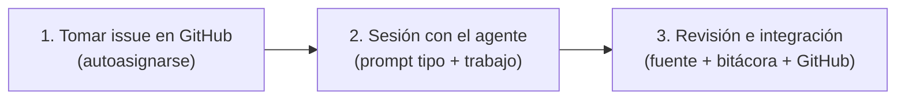

# Runbook: Resolución de issues con agentes

Esta guía explica cómo cualquier integrante del equipo (Luciano, Mateo, etc.) toma un
issue de GitHub, abre una sesión con su asistente de IA (Antigravity, Cursor, Claude Code, etc.)
y asegura que el resultado quede perfectamente integrado en el repositorio, manteniendo el
estado del proyecto vivo y trazable.

---

## 1. El ciclo en 3 pasos



1. **Tomar el issue:**
   - Entrar a GitHub Issues, abrir el issue que te toque (o autoasignarte uno del milestone actual).
   - Copiar el número y título del issue (ej: `#3 [Investigación] Construir catálogo inicial de escenarios argentinos`).

2. **Abrir la sesión con el agente en este repositorio:**
   - Abrir el workspace en tu editor/asistente.
   - Pegar uno de los **Prompts Tipo** de la sección 2 según lo que vayas a hacer.

3. **Revisar e integrar:**
   - El agente editará los archivos correspondientes y mantendrá el estado vivo (fuente de verdad + bitácora + riesgos/decisiones).
   - Revisás el diff (que no invente citas ni decisiones no consensuadas).
   - Copiás el **Comentario de Cierre** que redactó el agente y lo pegás en el issue de GitHub para cerrarlo (o reportar avance).

---

## 2. Prompts Tipo (Copiar y Pegar)

Elegí la plantilla que mejor se adapte a tu situación:

### Caso A: "Tengo notas o respuestas externas y quiero integrarlas"
*(Típico tras una clase con el profesor, una consulta académica, o información recolectada manualmente).*

```markdown
Estoy trabajando en el Issue #<NÚMERO>: <TÍTULO>.
Acá tengo las notas y resultados obtenidos:
<PEGAR NOTAS, RESPUESTAS DEL PROFESOR, ENLACES O DATOS>

Por favor:
1. Identificá qué fuentes de verdad del proyecto se ven afectadas (según AGENTS.md y GUIA-DE-ARCHIVOS.md) e integrá esta información.
2. Si resuelve o altera alguna decisión de MAPA-DECISIONES.md, actualizala.
3. Si impacta o mitiga riesgos en REGISTRO-RIESGOS.md, reflejalo.
4. Registrá el avance en la bitácora semanal en curso (docs/gestion/bitacora/).
5. Dame un bloque de texto listo para comentar y cerrar el issue en GitHub con Closes #<NÚMERO>.
```

---

### Caso B: "Quiero resolver un issue de investigación, diseño o redacción junto al agente"
*(Típico para catálogo de escenarios, diagramas de arquitectura, texto de propuesta, etc.).*

```markdown
Estoy trabajando en el Issue #<NÚMERO>: <TÍTULO>.
El objetivo es: <PEGAR OBJETIVO O CRITERIOS DEL ISSUE>.

Por favor:
1. Leé los archivos de contexto relevantes según el tipo y área del issue.
2. Proponé el contenido/diseño cumpliendo las reglas del proyecto (sin inventar citas ni decisiones, español argentino).
3. Una vez que lo revisemos, escribilo en la fuente de verdad correspondiente.
4. Actualizá la bitácora semanal y entregame el comentario de cierre para GitHub.
```

---

### Caso C: "Quiero ejecutar un spike técnico o experimento de código"
*(Típico para probar ASR local, scripts de audio, medición de latencias, etc.).*

```markdown
Estoy trabajando en el Issue #<NÚMERO>: <TÍTULO>.
Necesitamos ejecutar un experimento o spike técnico para: <OBJETIVO>.

Por favor:
1. Diseñá el script mínimo reproducible (en src/ o experiments/ según corresponda).
2. Recordá la Regla 3: NUNCA subir audio real/personal al repo; usamos audio de prueba no confidencial.
3. Registrá hardware, versión, comando de reproducción, métricas obtenidas y limitaciones observadas.
4. Dejá la evidencia en docs/ y el registro en la bitácora semanal.
5. Redactá el comentario de cierre para el issue.
```

---

### Caso D: "No sé por dónde arrancar / Agarrá el issue y guíame"
*(Típico si entrás al proyecto y necesitás saber qué hacer con un issue).*

```markdown
Tengo asignado el Issue #<NÚMERO>: <TÍTULO>.
No tengo claro por dónde arrancar ni qué archivos toca.
Por favor:
1. Explicame brevemente qué busca resolver este issue, qué fuentes de verdad afecta y cuál es la definición de terminado.
2. Decime qué decisiones previas o insumos necesitamos.
3. Proponé el primer paso concreto para que lo revisemos juntos.
```

---

## 3. Qué hace el agente automáticamente (La Sincronización)

Para que el proyecto no se desincronice, el agente está instruido para seguir siempre este circuito:

| Archivo | Qué hace el agente |
|---|---|
| **Fuente de verdad temática** (`CATALOGO-ESCENARIOS.csv`, `PLAN-DE-TRABAJO.md`, etc.) | Aplica los cambios sustantivos reales. |
| **Bitácora semanal** (`docs/gestion/bitacora/AAAA-MM-semana-NN.md`) | Agrega la fila en "Qué se hizo" y la viñeta en "Qué existe hoy que no existía". |
| **Mapa de decisiones** (`docs/gestion/MAPA-DECISIONES.md`) | Si el issue resuelve una decisión (ej. D01, D05), actualiza su estado. Si es técnica duradera, genera o propone un ADR. |
| **Registro de riesgos** (`docs/gestion/REGISTRO-RIESGOS.md`) | Si la evidencia mitiga un riesgo (ej. R01, R06) o abre una nueva incertidumbre, ajusta probabilidad/impacto o agrega una fila. |
| **Comentario de GitHub** | Genera un bloque Markdown listo para copiar al issue en GitHub. |

---

## 4. Formato del comentario de cierre en GitHub

El agente siempre debe cerrar la sesión entregándote un texto con este molde:

```markdown
### Cierre del Issue #<NÚMERO> — <TÍTULO>

**Resultado:**
<Resumen de 2 a 4 líneas de lo que se resolvió o descubrió.>

**Evidencia y archivos actualizados:**
- [Fuente principal](ruta/al/archivo.md): <qué cambió>
- [Bitácora semanal](docs/gestion/bitacora/...): registrado
- [Riesgos / Decisiones]: <actualizado si correspondió>

**Decisiones tomadas / abiertas:**
- <Decisión tomada o propuesta sin discutir con enlace>

**Nuevos riesgos o preguntas detectadas:**
- <Ninguno / Nuevo riesgo identificado: descripción>

**Próxima acción:**
- <Próximo issue o tarea habilitada>

Closes #<NÚMERO>
```

---

## 5. Reglas de oro para quien opera el agente

1. **Revisar antes de commitear:** El agente no debe inventar citas (`citeturn...` no son citas válidas) ni dar por cerradas decisiones que el equipo aún no votó o acordó con el profesor. Si el agente propone algo que requiere debate, debe quedar marcado como `> **Estado: propuesta sin discutir.**`.
2. **Audio y datos personales:** Nunca pedirle al agente que procese ni guarde audios reales de llamadas o datos identificatorios en el repositorio.
3. **Un solo tema por issue:** Si durante la sesión surge una idea o problema nuevo, no mezclarlo silenciosamente en el issue actual: pedirle al agente que redacte un nuevo issue para GitHub y seguir con el actual.

---

## 6. Skills disponibles de apoyo (Matt Pocock y nativas)

El repositorio incluye en `.agents/skills/` una colección de skills especializadas para elevar la disciplina y calidad del desarrollo. El agente las sugerirá cuando correspondan, pero también podés pedirlas directamente:

| Fase de trabajo | Skill | Para qué usarla |
|---|---|---|
| **Definir / Alinear** | `grill-me` / `grill-with-docs` | Entrevista implacable para desafiar un diseño, destrabar tickets vagos o resolver decisiones abiertas antes de codear. |
| **Especificar** | `to-spec` / `to-tickets` | Convierte una discusión en una especificación técnica o en issues trazables para GitHub. |
| **Construir código** | `implement` | Flujo de implementación rigurosa basado en especificación previa. |
| **Calidad de código** | `code-review` | Revisión cruzada de estándares y cobertura contra lo pedido en el issue antes de cerrar o mergear. |
| **Lógica crítica** | `tdd` | Desarrollo guiado por pruebas (ideal para algoritmos de detección, ventanas temporales `T_A`, `T_R`, `T_C` y métricas). |
| **Spikes rápidos** | `prototype` | Creación de prototipos mínimos descartables para responder dudas de viabilidad. |
| **Depuración** | `diagnosing-bugs` | Metodología sistemática para aislar fallas de ASR, errores o problemas de latencia. |
| **Integrar issue** | `resolver-issue` | Ciclo canónico de actualización de fuentes de verdad, bitácora y comentario de GitHub. |

