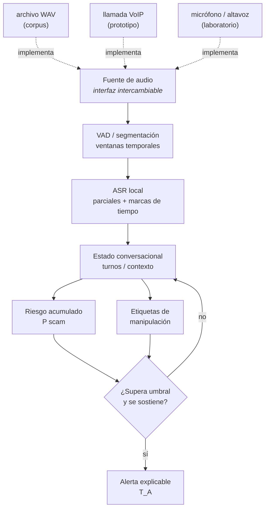

# Arquitectura

> **Borrador v0, sin validar.** Depende de
> [D03](../gestion/MAPA-DECISIONES.md#d03--congelar-alcance-y-contribución),
> [D05](../gestion/MAPA-DECISIONES.md#d05--elegir-la-fuente-de-audio-demostrable) y
> [D11](../gestion/MAPA-DECISIONES.md#d11--análisis-lingüístico-o-también-acústico).
> No es una decisión tomada: es el diagrama que se lleva a discutir.

## El principio que conviene preservar

**El motor no sabe de dónde viene el audio.** Esa única restricción de diseño permite desarrollar y
evaluar sobre archivos del corpus sin depender del dispositivo, y evita que un obstáculo de
plataforma bloquee todo el trabajo experimental.

Es la contraparte técnica de lo que las
[alternativas de captura](ALTERNATIVAS-CAPTURA-AUDIO.md) plantean como niveles: replay es la base
científica, VoIP la integración objetivo, y el micrófono la demo rápida. Si los tres implementan la
misma interfaz, cambiar de nivel no obliga a reescribir el detector.



El rombo de decisión es donde vive la histéresis: `T_A` no es el primer cruce del umbral sino el
primero que se sostiene dos actualizaciones. Ver [métricas](../evaluacion/METRICAS.md).

## Convención para diagramas

Los diagramas van en `.md` con bloques ` ```mermaid `, **no** en archivos `.mmd`: GitHub renderiza
Mermaid dentro de Markdown, pero muestra un `.mmd` como texto plano.

## Pendiente

- Interfaces concretas entre componentes (nombres, tipos, contratos).
- Dónde vive el umbral y cómo se calibra.
- Presupuesto de latencia y memoria por etapa, una vez elegido el dispositivo objetivo.
- Separación entre motor evaluable y UI, requisito para poder medir sin la aplicación.
