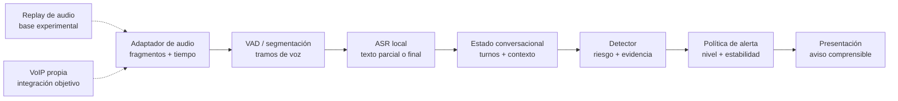

# Arquitectura v0 y avisos de riesgo

> **Estado: propuesta sin discutir.** Artefacto del [issue #20](https://github.com/Corchets/bitacora_tesis/issues/20)
> para revisión del equipo. La fuente de audio sí fue definida en
> [D05](../gestion/MAPA-DECISIONES.md#d05--elegir-la-fuente-de-audio-demostrable): replay
> reproducible como base experimental y VoIP propia como integración objetivo. Esta v0 no cierra
> [D07](../gestion/MAPA-DECISIONES.md#d07--aprobar-taxonomía-y-evento-crítico),
> [D08](../gestion/MAPA-DECISIONES.md#d08--congelar-protocolo-experimental),
> [D09](../gestion/MAPA-DECISIONES.md#d09--elegir-asr-y-detector) ni
> [D11](../gestion/MAPA-DECISIONES.md#d11--análisis-lingüístico-o-también-acústico).

## Recorrido de una llamada

El motor recibe el mismo tipo de fragmentos desde un replay de laboratorio o desde una llamada
VoIP propia y consentida. No necesita saber cuál de las dos fuentes los produjo. El camino dibujado
usa texto transcripto como entrada del detector para mostrar una interfaz mínima; agregar rasgos
acústicos sigue abierto en D11. El procesamiento local y el descarte del contenido al terminar la
sesión siguen la [política de privacidad](../datos-etica/PRIVACIDAD-DEL-SISTEMA.md).



La política de alerta recibe el resultado del detector, decide si hay un aviso estable y entrega
un evento a la presentación. Así se puede evaluar el motor con replay y registrar `T_A` sin abrir
una pantalla. La definición vigente de trabajo para `T_A` exige dos actualizaciones consecutivas
o una histéresis equivalente; los niveles, umbrales y cadencia todavía se deben fijar al cerrar D07
y D08 ([métricas](../evaluacion/METRICAS.md#definición-de-t_a-con-histéresis)). Los valores y
ejemplos de [VENTANA-DE-CONTEXTO-Y-ALERTA.md](../investigacion/VENTANA-DE-CONTEXTO-Y-ALERTA.md)
son hipótesis de laboratorio, no rendimiento medido.

## Responsabilidades y contratos conceptuales

| Componente | Responsabilidad | Entrada → salida mínima | Restricción principal |
|---|---|---|---|
| Adaptador de audio | Entregar fragmentos en orden temporal desde la fuente permitida. | Sesión de replay o VoIP → audio, tiempo relativo a la sesión y canal si se conoce. | El motor no depende de permisos de captura PSTN ni infiere quién habla cuando la fuente no separa canales. |
| VAD / segmentación | Identificar tramos de voz y armar unidades aptas para el ASR. | Fragmentos → tramos con inicio y fin. | No perder la referencia temporal ni convertir silencio en texto. |
| ASR local | Transcribir en forma incremental. | Tramos → texto parcial o final con intervalo temporal y revisión. | Los parciales pueden corregirse; una palabra reconocida no es evidencia infalible. |
| Estado conversacional | Mantener turnos, contexto y la última revisión válida de cada tramo. | Transcripciones y revisiones → estado temporal consultable. | Reemplazar un parcial por su revisión final sin duplicar evidencia; descartar contenido al terminar. |
| Detector | Estimar riesgo y señalar evidencia que lo sustenta. | Estado → puntaje, categorías de evidencia y referencia temporal. | No presentar un puntaje sin calibración como probabilidad de fraude; la taxonomía y el modelo siguen abiertos. |
| Política de alerta | Decidir si corresponde emitir, mantener o escalar un aviso. | Puntaje, evidencia y tiempo → nivel, motivo y `T_A` si hay alerta estable. | Evitar picos aislados y repeticiones; calibrar niveles y umbrales con la restricción de falsas alarmas. |
| Presentación | Mostrar una advertencia que permita actuar durante la conversación. | Evento de alerta → título, motivo, consecuencia y acción visible. | No afirmar que la llamada es una estafa ni prometer cortar o bloquear la llamada si la integración no lo hace. |

Cada actualización debe conservar un identificador efímero de sesión, tiempo relativo al audio y
versión del estado o de la revisión de ASR. Esto permite reconstruir qué evidencia produjo una
alerta sin guardar audio ni transcripciones en el registro persistente. El registro mínimo de
metadatos se rige por [PRIVACIDAD-DEL-SISTEMA.md](../datos-etica/PRIVACIDAD-DEL-SISTEMA.md);
el contenido temporal vive solo en memoria. Los nombres y tipos concretos de estas interfaces se
definen al implementarlas; esta tabla fija las obligaciones observables de cada componente.

## Dos mockups de aviso

> **Estado: propuesta sin discutir.** Son textos y distribución de pantalla para el escenario
> ficticio de un supuesto banco, no una UI implementada ni una política de clasificación aprobada.
> La comprensión, accesibilidad, niveles y activación se deben revisar con el equipo y probar con
> personas antes de congelarlos. Los ejemplos muestran evidencia distinta; no equivalen a umbrales
> numéricos ni a una afirmación de que el detector ya reconoce esas frases.

### Riesgo moderado — presión para abrir la aplicación

```text
┌──────────────────────────────────────────┐
│ Llamada en curso       ! RIESGO MODERADO  │
│                                          │
│ Revisá esta llamada                      │
│                                          │
│ Qué ocurre                               │
│ Dice llamar del banco y te apura para    │
│ abrir la aplicación.                     │
│                                          │
│ Por qué importa                          │
│ La urgencia dificulta verificar quién    │
│ llama. Puede ser un engaño.              │
│                                          │
│ Qué hacer                                │
│ No compartas códigos ni claves. Buscá    │
│ el número oficial y consultá vos.        │
│                                          │
│              [ Entendido ]               │
└──────────────────────────────────────────┘
```

### Riesgo alto — pedido de código

```text
┌──────────────────────────────────────────┐
│ Llamada en curso       !! RIESGO ALTO     │
│                                          │
│ No compartas el código                   │
│                                          │
│ Qué ocurre                               │
│ En esta llamada te pidieron un código    │
│ de verificación.                         │
│                                          │
│ Por qué importa                          │
│ Alguien podría usarlo para entrar a tu   │
│ cuenta. Puede ser una estafa.            │
│                                          │
│ Qué hacer                                │
│ No lo dictes. Cortá y llamá vos al       │
│ número oficial del banco.                │
│                                          │
│              [ Entendido ]               │
└──────────────────────────────────────────┘
```

El texto, el signo `!` y el nombre del nivel comunican gravedad sin depender solo del color. La
acción propuesta es una instrucción para la persona; `Entendido` solo cierra el aviso, no la llamada.
Si la evidencia detectada es otra, el motivo y la acción deberán corresponder a esa evidencia; no
se debe mostrar el ejemplo bancario como texto universal. Ningún aviso reproduce un código, una
clave ni un fragmento literal de la conversación.

## Lo que falta validar

- D07 y D08: etiquetas que autorizan un motivo, regla de niveles, umbrales, cadencia y conteo de
  falsas alarmas. El mockup no los congela.
- D09 y D11: modelos, calidad del ASR y decisión sobre rasgos acústicos. Un motivo visible necesita
  evidencia suficientemente confiable; el diseño no presupone que el ASR acierta.
- Prueba de comprensión de los avisos, accesibilidad en pantalla chica y comportamiento ante una
  alerta errónea o una escalada. Son parte del diseño de UI todavía abierto.

Los diagramas se mantienen en Markdown con bloques Mermaid para que GitHub los renderice dentro
del documento.
