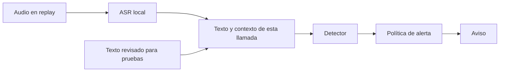

# Arquitectura conceptual y aviso de riesgo

Este documento permite revisar el recorrido del sistema en [#20](https://github.com/Corchets/bitacora_tesis/issues/20).
Describe qué información necesita cada parte; los modelos y las interfaces concretas
se decidirán al implementar y comparar alternativas.

## 1. Restricciones acordadas

- El replay de grabaciones es la base reproducible. VoIP propia es la integración
  objetivo, condicionada por la factibilidad; captura PSTN universal queda fuera.
- ASR y detector se ejecutan localmente. El detector analiza texto y conserva contexto
  de la llamada actual; no analiza tono ni otros rasgos acústicos para detectar fraude.
- Agenda, historial, reputación del número y dirección entrante/saliente no son entradas.
- Clase, escenario, etiquetas humanas, roles de atacante/víctima y `T_R`/`T_C` pertenecen
  a la referencia de evaluación. El detector no recibe esas respuestas.

Fuentes: [alcance del Plan](../propuesta/PLAN-DE-TRABAJO.md#6-alcance) y
[mapa de decisiones](../gestion/MAPA-DECISIONES.md).

## 2. Recorrido propuesto

Mateo aceptó usar un ejemplo bancario con fines didácticos el 2026-10-07. La sección 4
presenta una adaptación al par de WhatsApp seleccionado para el piloto.

> **Estado: propuesta sin discutir.** El flujo define responsabilidades conceptuales;
> la ventana y política siguen abiertas en [D08](../gestion/MAPA-DECISIONES.md#d08--congelar-protocolo-experimental)
> y los modelos en [D09](../gestion/MAPA-DECISIONES.md#d09--elegir-asr-y-detector).

```mermaid
flowchart LR
    A[Audio en replay] --> B[ASR local]
    B --> C[Texto y contexto de esta llamada]
    T[Texto revisado para pruebas] --> C
    C --> D[Detector]
    D --> E[Política de alerta]
    E --> F[Aviso]
```

La entrada de texto permite probar el detector antes de integrar ASR. Después se
reproduce el audio y se compara qué cambia por errores o demora de transcripción.
VoIP, si se integra, deberá alimentar ese mismo recorrido de audio.

| Parte | Recibe → produce | Qué hay que cuidar |
|---|---|---|
| Audio | Grabación → bloques de audio con relación temporal. | Entregar solo el audio disponible hasta ese momento. |
| ASR | Audio → actualizaciones de texto, intervalo de origen y momento de disponibilidad. | Declarar si entrega parciales, finales o revisiones. La segmentación puede estar dentro del ASR; no exige otro módulo. |
| Contexto | Actualizaciones → contenido disponible de esta llamada. | Incorporar revisiones sin duplicarlas y reiniciar al cambiar de llamada. |
| Detector | Texto con contexto → indicios de riesgo y evidencia que los sustenta. | No consultar texto futuro ni referencia humana. Un puntaje, si existe, no equivale automáticamente a probabilidad. |
| Política | Indicios → decisión de emitir un aviso y motivo. | Registrar la regla aplicada y el instante real de emisión. |
| Aviso | Decisión → advertencia comprensible y acción sugerida. | Explicar el riesgo sin afirmar identidad o fraude confirmado. |

Un bloque de audio, una actualización del ASR y un turno de conversación son cosas
distintas. No hace falta identificar turnos perfectos ni quién es el atacante para
empezar. Por ejemplo, el ASR puede entregar «pasame el código» y después completar
«del candado»: el detector debe interpretar lo disponible con el contexto previo
y la política debe decidir cómo tratar información todavía incompleta.

## 3. Referencia, tiempos y registros

La referencia humana se prepara por conversación según el [manual](../corpus/MANUAL-ANOTACION.md).
`T_R` y `T_C` se marcan sobre la grabación; `T_A` sale de la ejecución del sistema.
El intervalo al que corresponde un texto y el momento en que el sistema lo recibe
son distintos. La alerta incluye la demora de ASR y procesamiento: no se fecha hacia
atrás al comienzo o fin del fragmento. Las definiciones viven en [métricas](../evaluacion/METRICAS.md#1-marcas-temporales).
En pruebas con texto sin audio se informa posición o actualización, sin inventar segundos.

El experimento debe conservar datos, configuración y salidas suficientes para
reconstruir qué información produjo cada aviso. Audio y materiales vinculables
permanecen fuera de Git. Ese registro experimental se distingue del uso del prototipo,
cuyo tratamiento de contenido sigue la [política de privacidad](../corpus/PRIVACIDAD-DEL-SISTEMA.md).

## 4. Primer par escrito: del escenario al aviso

Se usa el par `SC-WA-CODE-01` / `LG-WA-CONSULTA-01` del
[catálogo](../corpus/CATALOGO-ESCENARIOS.csv), incluido en la
[selección del piloto](../corpus/METODO-CREACION-CORPUS.md#selección-inicial-del-piloto).
El par bancario conversado con Mateo tiene el mismo contraste didáctico, pero no
pertenece a esa selección. No se cambia el piloto para incorporar este ejercicio.

Mateo aceptó usar un caso directo para explicar la arquitectura el 2026-10-07 y
señaló su límite: el detector deberá probarse también con pedidos indirectos y
conversaciones largas. Este par no representa toda la dificultad del problema ni
demuestra rendimiento. Todo su contenido es ficticio.

### Escenarios y fichas de rol

Las fichas siguen el [método](../corpus/METODO-CREACION-CORPUS.md#5-fichas-de-rol).
Se entregan por separado; el diálogo siguiente ilustra una interpretación, no un
texto que haya que memorizar para grabar.

| Caso | Ficha A | Ficha B |
|---|---|---|
| Suplantación de soporte de WhatsApp | Busca obtener el código de activación por SMS con un pretexto ficticio. Puede crear urgencia y sostener el pretexto ante dudas. Si aceptan, escucha el código ficticio; si rechazan, termina. No agrega enlaces, pagos ni otras acciones. | Recibió un SMS ficticio y no pidió activar la cuenta. Actitud dudosa: puede preguntar para qué necesitan el código. Para esta rama acepta y dicta únicamente `000000`, inventado para el ejercicio. Puede rechazar y cerrar. |
| Consulta legítima a una persona conocida | Recibió un código inesperado y consulta cómo proteger la cuenta. Puede preguntar si necesita mostrarlo. No revela el código. | Orienta a no compartirlo y a revisar la seguridad desde la aplicación. Ante dudas explica que no necesita verlo; acepta que se interrumpa la consulta. No pide secretos ni acceso a la cuenta. |

Ambas personas conocen la condición de cierre: terminar después de la respuesta
al pedido o al consejo seguro, o antes si alguien lo solicita. Se detiene la
simulación si aparecen datos reales; no se activa ninguna cuenta ni se opera una app.

### Diálogos escritos

Las posiciones `F1`–`F5` y `L1`–`L4` permiten revisar el ejercicio. No son etiquetas
de atacante/víctima ni forman parte del texto que recibe el detector.

| Posición | Conversación fraudulenta |
|---|---|
| F1 | Te llamo de soporte por la activación de tu cuenta de WhatsApp. |
| F2 | Me acaba de llegar un SMS. No pedí activar nada. |
| F3 | Para cancelar esa activación tenemos que resolverlo ahora. |
| F4 | Decime el código de activación que recibiste por SMS. |
| F5 | Es cero, cero, cero, cero, cero, cero. |

| Posición | Conversación legítima difícil |
|---|---|
| L1 | Me llegó por SMS un código para activar WhatsApp y yo no lo pedí. |
| L2 | No me lo leas ni lo compartas. Revisá la seguridad desde la aplicación. |
| L3 | ¿Necesitás verlo para ayudarme? |
| L4 | No. No hace falta que me digas ningún código. |

### Referencia humana mínima, fuera del detector

Según el [manual](../corpus/MANUAL-ANOTACION.md#1-qué-registramos-por-conversación),
se guarda una ficha por conversación. Aquí las ubicaciones son textuales; no hay
`T_R` ni `T_C` medidos en segundos.

| Campo | Fraudulenta | Legítima difícil |
|---|---|---|
| Clase | `vishing`, por la suplantación simulada y el objetivo de la ficha | `legitima_dificil`, por el contexto ficticio y la conducta segura observada |
| Pedido que después se ubicará como `T_R` en audio | F4, desde «Decime» | Ausente |
| Cumplimiento que después se ubicará como `T_C` en audio | F5, desde el primer «cero» | Ausente |
| Evidencia seleccionada | F1–F3 como contexto, F4 como pedido (`REQUEST_AUTH_CODE`) y F5 como cumplimiento | L1–L4: mención de código, consejo de no compartirlo y rechazo explícito de recibirlo |
| Límite | La identidad real no puede verificarse solo por el diálogo. La clase no se deduce de la palabra «soporte». | La legitimidad de la ficha no es una entrada ni una garantía de que el detector acierte. |

La referencia describe lo escrito, no la salida del detector. Si una toma cambia
el diálogo o no incluye cumplimiento, se anota lo que ocurrió: no se copian estas
marcas automáticamente. `T_A` pertenece a la ejecución, no a esta ficha.

### Texto disponible y salida conceptual esperada

Cada llamada empieza con contexto vacío. En este ejercicio se agregan fragmentos
completos, sin revisiones de ASR. En cada actualización se dispone solo de las filas
ya entregadas, sin texto futuro. Los IDs y las posiciones sirven al registro; la
entrada del detector contiene únicamente el texto y contexto de la llamada actual.

| Actualización | Texto nuevo en la fraudulenta | Indicio esperado del detector | Texto nuevo en la legítima | Indicio esperado del detector |
|---|---|---|---|---|
| U1 | F1–F2 | Contexto de activación; todavía no hay pedido de revelar el código. | L1 | Mención de un código inesperado; no hay pedido de revelarlo. |
| U2 | F3 | Presión por resolver ahora; todavía no hay pedido del código. | L2 | Consejo de no compartirlo; no confundir la negación con un pedido. |
| U3 | F4 | Pedido explícito de código de activación, sustentado por F4 y el contexto anterior. | L3–L4 | La pregunta se responde rechazando recibir el código. No corresponde el aviso por pedido de código. |
| U4 | F5 | Cumplimiento visible; esta información no estaba disponible en U3. | Sin fragmento nuevo | No se inventa otra actualización para igualar longitudes. |

Estas son expectativas para revisar, no resultados de un detector ejecutado ni
doce etiquetas de salida obligatorias. La política recibe los indicios y decide
la emisión; detectar un pedido y mostrar un aviso son responsabilidades distintas.

> **Estado: propuesta sin discutir.** Para ilustrar el último paso, suponemos que
> la política emite el siguiente aviso después de procesar U3 de la fraudulenta.
> Es una rama didáctica, no la política final de
> [D08](../gestion/MAPA-DECISIONES.md#d08--congelar-protocolo-experimental).
>
> **Revisá esta llamada.** Te están pidiendo un código que podría dar acceso a tu cuenta.
> No lo compartas. Interrumpí la conversación y verificá el pedido por un canal conocido.

En este recorrido escrito se ubica el aviso después de U3; no se calcula un margen
temporal. En una ejecución con audio, `T_A` será el momento efectivo de emisión,
con la demora de ASR y procesamiento incluida, según la sección 3.

El motivo debe corresponder a la evidencia: un código de candado en una conversación
cotidiana no justifica este aviso. No se muestran códigos, claves ni citas sensibles.
Una acción sugerida para la persona no implica que el sistema pueda cortar la llamada.
La revisión de comprensión registrada aquí corresponde a Mateo sobre el ejemplo
bancario. La adaptación escrita a WhatsApp es asistida; no se atribuye una lectura
de estos diálogos exactos a Mateo ni a los otros integrantes, ni se reemplaza la
validación de D07 con audio.

## 5. Qué queda abierto

- **D07:** probar con audio los criterios de referencia humana y los motivos observables.
- **D08:** cuánto contexto usar, cuándo procesar, cómo tratar revisiones y cuándo alertar.
  No quedan fijados niveles de riesgo, umbrales ni dos detecciones consecutivas.
- **D09:** elegir ASR y detector mediante comparaciones. El recorrido puede probarse
  con texto antes de grabar o integrar ASR; un prototipo no elige el detector final.

H1 busca que el equipo entienda este recorrido y pueda preparar el primer par.
La arquitectura ejecutable y sus ajustes se comprueban en H2–H4.
