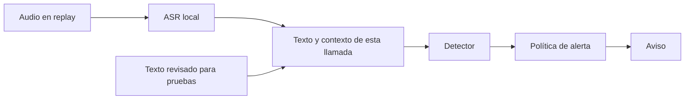

# Arquitectura conceptual y aviso de riesgo

Este documento permite revisar el recorrido del sistema en [#20](https://github.com/Corchets/bitacora_tesis/issues/20).
Describe qué información necesita cada parte; los modelos y las interfaces concretas
se decidirán al implementar y comparar alternativas.

## 1. Restricciones acordadas

- El replay de grabaciones es la base reproducible. VoIP propia es la integración
  objetivo, condicionada por la factibilidad; captura PSTN universal queda fuera.
- ASR y detector se ejecutan localmente. El detector analiza texto y conserva contexto
  de la llamada actual; no analiza tono ni otros rasgos acústicos para detectar fraude.
- Agenda, historial, reputación del número y dirección entrante/saliente no son entradas.
- Clase, escenario, etiquetas humanas, roles de atacante/víctima y `T_R`/`T_C` pertenecen
  a la referencia de evaluación. El detector no recibe esas respuestas.

Fuentes: [alcance del Plan](../propuesta/PLAN-DE-TRABAJO.md#6-alcance) y
[mapa de decisiones](../gestion/MAPA-DECISIONES.md).

## 2. Recorrido propuesto

> **Estado: propuesta sin discutir.** La organización del flujo se revisa en #20;
> la ventana y política siguen abiertas en [D08](../gestion/MAPA-DECISIONES.md#d08--congelar-protocolo-experimental)
> y los modelos en [D09](../gestion/MAPA-DECISIONES.md#d09--elegir-asr-y-detector).

```mermaid
flowchart LR
    A[Audio en replay] --> B[ASR local]
    B --> C[Texto y contexto de esta llamada]
    T[Texto revisado para pruebas] --> C
    C --> D[Detector]
    D --> E[Política de alerta]
    E --> F[Aviso]
```

La entrada de texto permite probar el detector antes de integrar ASR. Después se
reproduce el audio y se compara qué cambia por errores o demora de transcripción.
VoIP, si se integra, deberá alimentar ese mismo recorrido de audio.

| Parte | Recibe → produce | Qué hay que cuidar |
|---|---|---|
| Audio | Grabación → bloques de audio con relación temporal. | Entregar solo el audio disponible hasta ese momento. |
| ASR | Audio → actualizaciones de texto, intervalo de origen y momento de disponibilidad. | Declarar si entrega parciales, finales o revisiones. La segmentación puede estar dentro del ASR; no exige otro módulo. |
| Contexto | Actualizaciones → contenido disponible de esta llamada. | Incorporar revisiones sin duplicarlas y reiniciar al cambiar de llamada. |
| Detector | Texto con contexto → indicios de riesgo y evidencia que los sustenta. | No consultar texto futuro ni referencia humana. Un puntaje, si existe, no equivale automáticamente a probabilidad. |
| Política | Indicios → decisión de emitir un aviso y motivo. | Registrar la regla aplicada y el instante real de emisión. |
| Aviso | Decisión → advertencia comprensible y acción sugerida. | Explicar el riesgo sin afirmar identidad o fraude confirmado. |

Un bloque de audio, una actualización del ASR y un turno de conversación son cosas
distintas. No hace falta identificar turnos perfectos ni quién es el atacante para
empezar. Por ejemplo, el ASR puede entregar «pasame el código» y después completar
«del candado»: el detector debe interpretar lo disponible con el contexto previo
y la política debe decidir cómo tratar información todavía incompleta.

## 3. Referencia, tiempos y registros

La referencia humana se prepara por conversación según el [manual](../corpus/MANUAL-ANOTACION.md).
`T_R` y `T_C` se marcan sobre la grabación; `T_A` sale de la ejecución del sistema.
El intervalo al que corresponde un texto y el momento en que el sistema lo recibe
son distintos. La alerta incluye la demora de ASR y procesamiento: no se fecha hacia
atrás al comienzo o fin del fragmento. Las definiciones viven en [métricas](../evaluacion/METRICAS.md#1-marcas-temporales).
En pruebas con texto sin audio se informa posición o actualización, sin inventar segundos.

El experimento debe conservar datos, configuración y salidas suficientes para
reconstruir qué información produjo cada aviso. Audio y materiales vinculables
permanecen fuera de Git. Ese registro experimental se distingue del uso del prototipo,
cuyo tratamiento de contenido sigue la [política de privacidad](../corpus/PRIVACIDAD-DEL-SISTEMA.md).

## 4. Ejemplo de aviso para revisar

> **Estado: propuesta sin discutir.** Ilustra una solicitud de código de acceso
> en un contexto de suplantación. No demuestra que el detector ya pueda reconocerla.
>
> **Revisá esta llamada.** Te están pidiendo un código que podría dar acceso a tu cuenta.
> No lo compartas. Interrumpí la conversación y verificá el pedido por un canal conocido.

El motivo debe corresponder a la evidencia: un código de candado en una conversación
cotidiana no justifica este aviso. No se muestran códigos, claves ni citas sensibles.
Una acción sugerida para la persona no implica que el sistema pueda cortar la llamada.
Para H1 revisamos comprensión con el equipo; no se agrega un estudio de usuarios como
condición del arranque.

## 5. Qué queda abierto

- **D07:** probar con audio los criterios de referencia humana y los motivos observables.
- **D08:** cuánto contexto usar, cuándo procesar, cómo tratar revisiones y cuándo alertar.
  No quedan fijados niveles de riesgo, umbrales ni dos detecciones consecutivas.
- **D09:** elegir ASR y detector mediante comparaciones. Se empieza con reglas sobre
  texto; reutilizar el laboratorio depende de que sirva para estas tareas.

H1 busca que el equipo entienda este recorrido y pueda preparar el primer par.
La arquitectura ejecutable y sus ajustes se comprueban en H2–H4.
