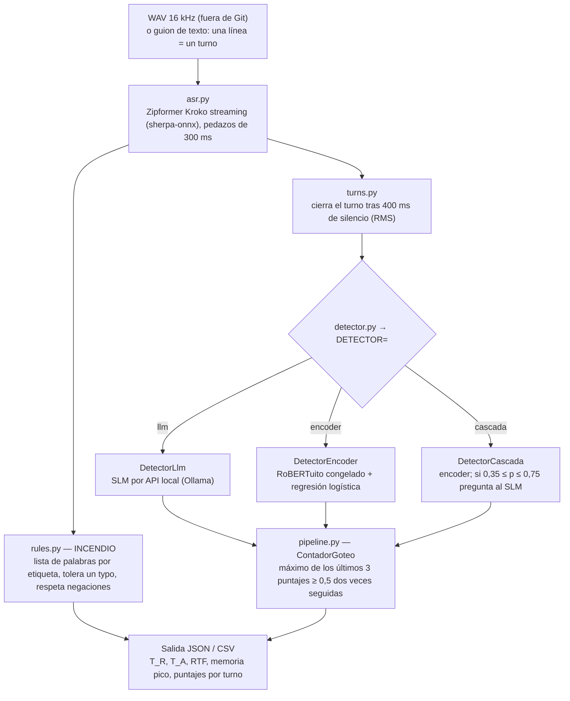

# Contraste entre el marco teórico NLP (#27) y el laboratorio del spike #29

**Fecha:** 2026-09-29
**Sobre:** [ESTRATEGIA-MODELOS-NLP-Y-COMPRESION.md](ESTRATEGIA-MODELOS-NLP-Y-COMPRESION.md)
(Luciano, [#27](https://github.com/Corchets/bitacora_tesis/issues/27)) y el laboratorio de Ignacio
([#28](https://github.com/Corchets/bitacora_tesis/issues/28) /
[#29](https://github.com/Corchets/bitacora_tesis/issues/29)).
**Estado:** registro de contraste. **No cierra D09** ni elige modelo. **Propuesta sin discutir** en
todo lo que sea recomendación.

> **Fuente de los datos del laboratorio.** Todo lo que se cita del laboratorio sale de la rama
> `nacho1706/experimento-spike-config-alta-zipformer-kroko-tf`, commit
> [`5ac40b5`](https://github.com/Corchets/bitacora_tesis/tree/5ac40b5bf3194e92b619802b7983ab61133d09fe/experiments/laboratorio)
> (2026-09-28), que **todavía no está en `main`**. Ignacio avisó que el laboratorio **no está
> terminado**. Los números de abajo son una foto de esa fecha, no resultados finales. Los enlaces
> apuntan a ese commit para que no cambien si la rama sigue avanzando.

---

## 1. Resumen

- El #27 es un **marco teórico escrito antes de medir**: propone una cascada, con un encoder
  liviano (RoBERTuito) en cada turno y un SLM que solo se consulta en la "zona gris". Sus cifras de
  latencia y memoria son de referencia y la tabla de la §6.2 viene de una simulación.
- Ignacio **implementó esa misma cascada** con modelos reales, usando los umbrales 0,35/0,75 y la
  base institucional del #27 tal cual, y la corrió en modo texto el 2026-09-28.
- **Lo que se confirmó:** las reglas de pedido crítico funcionan como vía rápida (13/16) y el SLM
  se consulta en una minoría de turnos (24%).
- **Lo que se refutó en esta corrida:** la cascada **empeoró** al encoder solo (goteo 12/16 → 7/16,
  AUROC 0,666 → 0,537, las mismas 5/10 falsas alarmas). El SLM tardó ~3,9 s por turno y no
  450–850 ms. Encoder y SLM juntos ocupan ~1,7 GB **de RAM** sin contar el ASR, así que no entran en
  el techo de 1024 MB de RAM de gama alta. El disco no es la restricción (ver §3.1).
- **Lo que queda sin probar:** el encoder cuantizado INT8/ONNX, el ajuste fino (LoRA o cabeza
  entrenada con datos reales), la calibración de umbrales, el audio y el hardware ARM.
- **El resultado depende sobre todo de los datos.** Con semillas provisorias el encoder aprende
  dialecto y forma del texto, no maniobras (R16). Por eso ninguna cifra de calidad de esta corrida
  sirve todavía para decidir D09.

---

## 2. Qué construyó Ignacio en el laboratorio

### 2.1 La idea

Una **sola lógica de detección** que corre en una PC dentro de Docker, con techos de memoria e
hilos que imitan un teléfono de cada gama (baja, media y alta). Lee una llamada, la parte en turnos
y en cada momento responde dos preguntas por separado:

- **Incendio:** ¿apareció un pedido peligroso explícito, como un código, una clave o una
  transferencia? Lo responden unas **reglas escritas a mano**, y avisa enseguida.
- **Goteo:** ¿la conversación viene sostenidamente sospechosa aunque todavía no haya pedido? Lo
  responde **un modelo que le pone un puntaje de 0 a 1 a cada turno**, más un contador que exige
  que el puntaje se mantenga alto.

`T_R` es el turno del primer incendio y `T_A` el del goteo. Si `T_A` llega antes que `T_R`, el
sistema avisó antes del pedido. Las definiciones están en [METRICAS.md](../evaluacion/METRICAS.md).

### 2.2 El recorrido de un turno

### 2.3 Las piezas

| Archivo | Qué hace |
|---|---|
| [`asr.py`](https://github.com/Corchets/bitacora_tesis/blob/5ac40b5bf3194e92b619802b7983ab61133d09fe/experiments/laboratorio/asr.py) | Baja Zipformer Kroko del Hub y transcribe en streaming. Moonshine, previsto para gama baja, figura solo como id: no está implementado. |
| [`turns.py`](https://github.com/Corchets/bitacora_tesis/blob/5ac40b5bf3194e92b619802b7983ab61133d09fe/experiments/laboratorio/turns.py) | Corta turnos por silencio: RMS < 0,02 durante 400 ms. No es un VAD de tesis. |
| [`rules.py`](https://github.com/Corchets/bitacora_tesis/blob/5ac40b5bf3194e92b619802b7983ab61133d09fe/experiments/laboratorio/rules.py) | Incendio: patrones por etiqueta (`REQUEST_AUTH_CODE`, `REQUEST_SECRET`, `REQUEST_TRANSFER`, …). Tolera un typo en palabras de 6 letras o más y no dispara si el turno niega el pedido sin imperativo («ningún banco te pide el código»). |
| [`detector_encoder.py`](https://github.com/Corchets/bitacora_tesis/blob/5ac40b5bf3194e92b619802b7983ab61133d09fe/experiments/laboratorio/detector_encoder.py) | RoBERTuito **congelado** en PyTorch fp32 (sin ajuste fino y sin cuantizar). Promedia los vectores del turno y una **regresión logística** (seed 42) entrenada con las semillas devuelve el puntaje. |
| [`detector.py`](https://github.com/Corchets/bitacora_tesis/blob/5ac40b5bf3194e92b619802b7983ab61133d09fe/experiments/laboratorio/detector.py) | Cliente del SLM por API compatible con OpenAI. Tiene tres modos: `clasificador`, `agente` (checklist de etiquetas) y `base`, que usa la **base institucional del #27 copiada sin cambios**. Sin servidor, el turno queda "sin opinión". |
| [`detector_cascada.py`](https://github.com/Corchets/bitacora_tesis/blob/5ac40b5bf3194e92b619802b7983ab61133d09fe/experiments/laboratorio/detector_cascada.py) | La cascada del #27: el encoder puntúa. Si el puntaje cae en [0,35; 0,75], el puntaje del SLM **reemplaza** al del encoder, y si el SLM no contesta queda el del encoder. Registra los ms de cada capa y cuántos turnos van a la zona gris. |
| [`pipeline.py`](https://github.com/Corchets/bitacora_tesis/blob/5ac40b5bf3194e92b619802b7983ab61133d09fe/experiments/laboratorio/pipeline.py) | Une todo. Tiene un modo audio (replay en streaming, calcula `RTF`) y un modo texto (sin ASR, latencia en turnos). Acá está `ContadorGoteo`. |
| [`gamas.json`](https://github.com/Corchets/bitacora_tesis/blob/5ac40b5bf3194e92b619802b7983ab61133d09fe/experiments/laboratorio/gamas.json) · [`docker-compose.yml`](https://github.com/Corchets/bitacora_tesis/blob/5ac40b5bf3194e92b619802b7983ab61133d09fe/experiments/laboratorio/docker-compose.yml) | Techos por gama: 256, 512 y **2048 MB** en alta, que antes era 1024 (propuesta). Hilos 2/4/6. Hay dos servicios: `corrida` (ASR + encoder) y `slm` (Ollama con `llama3.2:1b-instruct-q4_K_M` y contexto de 1024). |
| [`casos/`](https://github.com/Corchets/bitacora_tesis/blob/5ac40b5bf3194e92b619802b7983ab61133d09fe/experiments/laboratorio/casos/README.md) · [`chequear_casos.py`](https://github.com/Corchets/bitacora_tesis/blob/5ac40b5bf3194e92b619802b7983ab61133d09fe/experiments/laboratorio/chequear_casos.py) | 21 guiones inventados (13 de vishing y 8 legítimos "difíciles" del mismo tema) más 5 casos difíciles, con un *oracle* que falla si el incendio no da lo esperado. También hace pruebas de typos, mayúsculas, tildes y muletillas. |
| [`correr_encoders.py`](https://github.com/Corchets/bitacora_tesis/blob/5ac40b5bf3194e92b619802b7983ab61133d09fe/experiments/laboratorio/correr_encoders.py) · [`correr_cascada.py`](https://github.com/Corchets/bitacora_tesis/blob/5ac40b5bf3194e92b619802b7983ab61133d09fe/experiments/laboratorio/correr_cascada.py) | Corren la suite con cada detector y escriben un CSV por corrida. |
| [`armar_semillas.py`](https://github.com/Corchets/bitacora_tesis/blob/5ac40b5bf3194e92b619802b7983ab61133d09fe/experiments/laboratorio/armar_semillas.py) · [`semillas_manifiesto.json`](https://github.com/Corchets/bitacora_tesis/blob/5ac40b5bf3194e92b619802b7983ab61133d09fe/experiments/laboratorio/semillas_manifiesto.json) | Arman los datos para entrenar la regresión. Las estafas son turnos del estafador de 8 grabaciones argentinas de YouTube, distintas de las de evaluación. Las legítimas son turnos argentinos sin maniobra más 70 turnos de ES-Port (soporte telefónico de España, CC BY-SA 3.0 ES). Al repositorio va solo el manifiesto, con ids y números de turno; el texto no. |
| [`resultados/`](https://github.com/Corchets/bitacora_tesis/blob/5ac40b5bf3194e92b619802b7983ab61133d09fe/experiments/laboratorio/resultados/GLOSARIO-COLUMNAS.md) | Los CSV de cada fecha y un glosario que explica cada columna. |

El procedimiento para correrlo está en
[GUIA-CORRIDA-LABORATORIO.md](https://github.com/Corchets/bitacora_tesis/blob/5ac40b5bf3194e92b619802b7983ab61133d09fe/docs/investigacion/GUIA-CORRIDA-LABORATORIO.md)
(en su rama).

### 2.4 Cronología

| Fecha | Qué pasó |
|---|---|
| 2026-09-16 | Abre [#28](https://github.com/Corchets/bitacora_tesis/issues/28): una lógica, dos modelos ("quien escribe" y "quien lee") y techos por gama. |
| 2026-09-17 | Abre [#29](https://github.com/Corchets/bitacora_tesis/issues/29) para la gama alta y crea el primer esqueleto del laboratorio. En ese momento el detector era TF-IDF + reglas. |
| 2026-09-23 | Arma la suite de 21 guiones y el *oracle*. Hace **25 pasadas de ajuste** del stub TF-IDF, cada una documentada en `casos/README.md`, y concluye que el stub llegó a su techo. Escribe los borradores de D07 y D08, que después abre como [#32](https://github.com/Corchets/bitacora_tesis/issues/32) y [#33](https://github.com/Corchets/bitacora_tesis/issues/33). |
| 2026-09-24 | Prueba cuatro encoders congelados (BETO, RoBERTuito, DistilBETO y ALBETO tiny) con 24 frases inventadas y suma los 5 casos difíciles. |
| 2026-09-25 | Pivotea: saca TF-IDF del camino y pone un LLM/SLM local como detector (comentario en [#27](https://github.com/Corchets/bitacora_tesis/issues/27)). Hace la única corrida con audio, todavía con TF-IDF. |
| 2026-09-28 | Implementa la cascada del #27, arma semillas provisorias y corre encoder solo contra cascada. Cierra #29 con evidencia en texto y abre [#41](https://github.com/Corchets/bitacora_tesis/issues/41) (datos) y [#42](https://github.com/Corchets/bitacora_tesis/issues/42) (audio). |

---

## 3. Cifras del marco contra cifras medidas

Las columnas no son comparables uno a uno. El marco supone un **teléfono ARM con el encoder
cuantizado INT8 en ONNX**, y el laboratorio midió en una **PC x86 de 8 CPU sin GPU, con el
encoder en PyTorch fp32**. Lo que sí muestra la tabla es que las cifras del marco no tienen respaldo
propio y que la primera medición real está lejos de ellas.

| Qué | Marco #27 (supuesto, no medido) | Laboratorio 2026-09-28 (medido) | Lectura |
|---|---|---|---|
| RoBERTuito: ms por turno | 38–42 ms (INT8) | **~152 ms** (p50, fp32 + LR) | El marco suponía INT8, que no se probó. La cuantización queda pendiente de medir. |
| RoBERTuito: RAM | 145 MB (INT8) | **~875 MB de RAM** (pico RSS del proceso) | El pico incluye PyTorch y transformers. No mide solo el modelo, pero es lo que ocupa hoy. |
| Llama 3.2 1B Q4: ms por turno | 450–850 ms | **~3.884 ms** (p50) | Es ~5 veces lo supuesto, con contexto de 1024 tokens y en x86. |
| Llama 3.2 1B Q4: RAM | 780 MB | **~860 MB de RAM** (Ollama `/api/ps`: pesos cargados + caché de contexto) | Del mismo orden. |
| Encoder + SLM en gama alta | Entra en 1024 MB de RAM con el ASR | ~880 + ~860 MB de RAM, **sin el ASR** | No entra en 1024 MB de RAM. Ignacio propuso subir el techo a 2048 MB, lo que cambia lo aprobado en #24. |
| Turnos que van al SLM | Pocos: la simulación habla de "85% de turnos inocentes" | **126 de 523 (24%)** | Uno de cada cuatro turnos va al SLM, así que el costo del SLM no es marginal. |
| Negación («no te voy a dar la clave») | Encoder 0,09 (simulado) | `banco-niega-el-codigo`: máximo 0,189, sin goteo | Coincide en el único caso probado. |
| Mención inocente («código de la puerta») | Encoder 0,12 (simulado) | `portero-codigo-puerta`: goteo máximo 0,211, pero **las reglas sí disparan incendio** | El encoder no se confunde, pero la vía rápida por reglas sí. |
| Charla familiar sobre un asado | Encoder 0,15 (simulado) | **0,99** según [R16](https://github.com/Corchets/bitacora_tesis/blob/5ac40b5bf3194e92b619802b7983ab61133d09fe/docs/gestion/REGISTRO-RIESGOS.md) | La frase del asado es un caso de `benchmark_nlp.py`. R16 no dice cómo se corrió esa sonda y no aparece en los CSV. Hay que confirmarlo con Ignacio. |

### 3.1 RAM y disco no son lo mismo

Los techos de gama (256/512/1024 MB) son de **RAM**: pico de memoria residente del pipeline, según
[PREFACTIBILIDAD-TECNICA.md](PREFACTIBILIDAD-TECNICA.md). Todas las cifras de memoria de este
documento son RAM. El disco no es la restricción, porque un teléfono de 64–128 GB guarda sin
problema los ~1,2 GB de archivos.

| Modelo | Disco (archivo de pesos) | RAM medida al correr | Por qué se parecen o no |
|---|---:|---:|---|
| RoBERTuito fp32 | 415 MB (`model.safetensors` en Hugging Face, consulta 2026-09-29) | ~875 MB | La RAM suma los pesos más PyTorch, transformers y el tokenizador. En INT8/ONNX los pesos serían ~4 veces más chicos y el runtime más liviano (a medir). |
| Llama 3.2 1B Q4_K_M | 808 MB (ficha de Ollama, consulta 2026-09-29) | ~860 MB | Casi igual: el modelo necesita todos sus pesos en RAM para generar cada token, más la caché de contexto. |

Esto relativiza una idea de la §3.2 del #27: mapear el modelo con `mmap` no ahorra RAM mientras
el SLM se consulta seguido. Solo le permite al sistema liberar esa memoria cuando el SLM está
quieto.

Otras corridas de referencia:

- **Audio del 2026-09-25**, con TF-IDF como detector y techo de 1024 MB: `RTF` entre 0,16 y 0,72 y
  ~420 MB. Muestra que el ASR sigue el ritmo de la llamada en esa PC, pero **no se midió con el
  encoder ni con la cascada**. Eso queda para [#42](https://github.com/Corchets/bitacora_tesis/issues/42).
- **Encoders del 2026-09-24** entrenados con 24 frases inventadas: los cuatro marcan goteo en 16/16
  vishing **y en 10/10 legítimas**, con ~820–860 MB de pico. Con tan pocos ejemplos el puntaje no
  discrimina y todo da alerta.
- **TF-IDF del 2026-09-24:** 13/16 y 1/10 falsas alarmas, con ~131 MB. Parece el mejor, pero sus
  semillas se ajustaron mirando los mismos casos durante 25 pasadas, así que tiene fuga de
  información (el propio Ignacio lo registra). **No sirve para defender ni para refutar** lo que el
  #27 dice sobre TF-IDF.

---

## 4. Hipótesis del marco: qué pasó con cada una

| # | Hipótesis del #27 | Estado al 2026-09-28 | Evidencia |
|---|---|---|---|
| H1 | Las reglas de pedido crítico sirven como vía rápida | **Confirmada, con límites** | Incendio 13/16. Fallan los 3 casos difíciles que piden sin la palabra clave (dígitos, pantalla, giro) y hay un incendio falso con «código de la puerta». |
| H2 | Un encoder en cada turno es barato (< 45 ms, ~145 MB) | **Sin probar en la forma propuesta.** Medido en fp32: ~152 ms y ~875 MB | Falta cuantizar a INT8/ONNX y medir en ARM. |
| H3 | El encoder resuelve negaciones y menciones inocentes mejor que las palabras clave | **Parcial** | Acierta en la negación y en el portero, pero da 5/10 falsas alarmas en legítimas del mismo tema y 0,99 en el asado. Con semillas provisorias aprende dialecto, no maniobras (R16). |
| H4 | El SLM en la zona gris mejora la decisión | **Refutada en esta corrida** | Goteo 12/16 → 7/16, AUROC 0,666 → 0,537 y falsas alarmas iguales (5/10). Llama 3.2 1B sin ajuste responde `{"riesgo": 0}` a casi todo. |
| H5 | La base institucional offline le permite al SLM detectar la suplantación de ANSES | **Refutada en esta corrida** | En `anses-beneficio` el máximo baja de 0,536 (encoder) a 0,309 (cascada), y en su paráfrasis de 0,737 a 0,18. En ninguno de los dos hay goteo. |
| H6 | El SLM responde en 450–850 ms | **Refutada en PC x86** | ~3,9 s por turno. |
| H7 | El SLM se usa poco, así que el costo es bajo | **Parcial** | Va al SLM el 24% de los turnos. |
| H8 | Llama 3.2 1B entra en gama alta (1024 MB de RAM) | **Refutada** | ~1,7 GB de RAM sin el ASR. SmolLM2-360M sigue como alternativa sin medir. |
| H9 | Umbrales 0,35/0,75 como punto de partida | **Usados, sin calibrar** | La calibración de la §5 del #27 no se hizo. |
| H10 | Ajuste de dominio con LoRA | **Sin probar** | El encoder está congelado y el SLM no tiene ajuste. |
| H11 | Fin de turno por VAD con 600 ms | **Sin probar** | El laboratorio usa 400 ms. Las transcripciones se partieron en bloques de 25 palabras porque el cortador no está definido. |
| H12 | Alertar con riesgo alto en dos evaluaciones consecutivas | **Problema compartido** | Ver §6. |

Lo que se refutó es **esta configuración**: Llama 3.2 1B sin ajuste, un encoder congelado con
semillas provisorias y umbrales sin calibrar. La idea de cascada no queda descartada, pero hoy no
hay evidencia a favor. Cualquier conclusión sobre la cascada tiene que esperar a
[#41](https://github.com/Corchets/bitacora_tesis/issues/41).

---

## 5. En qué difieren los dos enfoques

| Aspecto | Marco #27 (Luciano) | Laboratorio #29 (Ignacio) |
|---|---|---|
| Naturaleza | Revisión teórica y diseño, escrito antes de medir | Implementación y medición iterativa |
| Plataforma supuesta | Teléfono ARM | PC x86 en Docker con techos que imitan gamas (R13) |
| Encoder | RoBERTuito **ajustado** y cuantizado INT8 en ONNX | RoBERTuito **congelado** fp32 + regresión logística |
| SLM | SmolLM2-360M en gama media y Llama 3.2 1B en alta, GGUF 4-bit con `mmap` | Llama 3.2 1B Q4_K_M en Ollama, contexto 1024 y respuesta JSON forzada |
| Qué hace el SLM | "Modula" el evento y da un dictamen estructurado | Su puntaje **reemplaza** al del encoder |
| TF-IDF | Baseline comparativo de control | **Eliminado** del camino el 2026-09-25 (ver §8) |
| Datos del detector | LoRA sobre el catálogo de escenarios (no existe todavía) | Semillas provisorias de YouTube + ES-Port, fuera de Git |
| Memoria y alerta | Registro de eventos con decaimiento (#23) | `ContadorGoteo`: máximo de 3 + dos seguidas |
| Techo de gama alta | 1024 MB | 2048 MB (propuesta) |
| Evidencia | Cifras de referencia sin fuente y una salida simulada | CSV con commit, seed, hardware y glosario de columnas |

---

## 6. Punto en común con el #23: la regla de alerta

Los dos trabajos llegaron por separado al mismo defecto:

- [VENTANA-DE-CONTEXTO-Y-ALERTA.md §11](VENTANA-DE-CONTEXTO-Y-ALERTA.md#11-reconciliación-con-el-contador-del-recorte-de-modelos)
  (Luciano, 2026-09-18) demostró que el "máximo de los últimos 3 turnos + alto dos veces seguidas"
  se cumple con **un solo pico**. Con 99% de acierto por revisión, deja al 54,8% de las llamadas
  legítimas con alguna falsa alarma, casi lo mismo que no tener regla.
- Ignacio lo encontró en el código el 2026-09-23 (hallazgo de la serie 8–12 en
  [`casos/README.md`](https://github.com/Corchets/bitacora_tesis/blob/5ac40b5bf3194e92b619802b7983ab61133d09fe/experiments/laboratorio/casos/README.md)):
  el contador dispara con un turno alto más cualquier turno con opinión. Lo llevó a
  [#33](https://github.com/Corchets/bitacora_tesis/issues/33) (D08).

El `ContadorGoteo` del laboratorio **todavía tiene esa regla**, así que parte de las 5/10 falsas
alarmas puede venir de ahí y no del detector.

> **Estado: propuesta sin discutir.** Antes de la próxima corrida conviene cambiar el contador por
> la opción B del #23 ("2 de los últimos 3") o, como mínimo, correr las dos variantes, para separar
> el efecto del detector del efecto de la regla. Decide D08
> ([#33](https://github.com/Corchets/bitacora_tesis/issues/33)).

---

## 7. Dificultades que tuvo Ignacio

1. **El stub TF-IDF llegó a su techo.** En 25 pasadas, cada ajuste de una palabra en las semillas
   ganaba margen en una clase y lo perdía en la otra. Además, las semillas espejaban los casos, lo
   que repite la fuga que prohíbe
   [METODO-CREACION-CORPUS.md §9](../datos-etica/METODO-CREACION-CORPUS.md#9-división-de-datos).
   Eso motivó el pivote del 2026-09-25.
2. **No hay datos de entrenamiento.** Con 24 frases inventadas los encoders dan alerta en todo.
   Para tener algo tuvo que armar semillas con grabaciones de YouTube (voces de terceros, que no
   pueden ir a Git) y con ES-Port, que es español de España. Eso mete **sesgo de dialecto**: lo
   argentino parece estafa (R16). El etiquetado de esos turnos lo hizo un agente y el equipo todavía
   no lo revisó.
3. **El SLM chico sin ajuste no sirve como árbitro.** Sin `response_format` JSON, Llama 3.2 1B Q4
   contesta en prosa. Con JSON forzado responde riesgo 0 a casi todo.
4. **Memoria.** Con el contexto por defecto de 4096 tokens, Ollama reservaba ~1,4 GB. Lo bajó a
   1024 y recortó los turnos del historial a 300 caracteres. Aun así encoder y SLM suman ~1,7 GB de RAM,
   y por eso propuso subir el techo de alta a 2048 MB.
5. **Lentitud.** La suite con cascada tardó ~624 s, contra ~100 s con el encoder solo, por los
   ~3,9 s de cada consulta al SLM.
6. **Cortador de turnos sin definir.** Para las 4 grabaciones partió el texto en bloques fijos de
   25 palabras (~10 s de habla). Eso es un parámetro de laboratorio, no D08.
7. **Las grabaciones públicas no son llamadas limpias.** Son estafas editadas por medios, con
   narración, así que no permiten medir falsas alarmas. Además, el encoder satura cerca de 1 en
   ellas.
8. **Sin audio para la cascada.** La única corrida con audio (2026-09-25) usaba TF-IDF, y la
   medición conjunta con WAV quedó para #42.
9. **Hardware.** Todo corrió en una PC x86. No dice nada sobre un teléfono ARM (R13).
10. **Reproducibilidad.** Los CSV del 2026-09-28 registran el commit como
    `9898033…+cambios-sin-commit`: la versión exacta del código que los generó no quedó fijada.
11. **Trabajo en varias máquinas.** Hay un commit del 2026-09-23 que dice "push para trabajar
    desde otra pc (incompleto)".
12. **Integración.** La rama no tiene PR y #29 se cerró con evidencia que no está en `main`.

---

## 8. Cosas a revisar antes de integrar la rama de Ignacio

No son errores del laboratorio, pero tocan decisiones del equipo:

- **Cambia una decisión cerrada.** En su rama, "Mantener baselines simples: reglas y TF–IDF son
  comparadores obligatorios", que está en *Decisiones cerradas* de
  [MAPA-DECISIONES.md](../gestion/MAPA-DECISIONES.md#decisiones-cerradas), pasa a "TF–IDF fuera
  del camino". También edita [PLAN-DE-TRABAJO.md](../propuesta/PLAN-DE-TRABAJO.md) (etapa 4 y
  cronograma). Las dos cosas son cambio de método: hay que discutirlas entre los cuatro y llevarlas
  al tutor. Además chocan con el #27, que conserva TF-IDF como baseline de control.
- **Techo de 2048 MB en gama alta.** Cambia lo aprobado en #24
  ([PREFACTIBILIDAD-TECNICA.md](PREFACTIBILIDAD-TECNICA.md)). Está marcado como propuesta, pero
  tiene que revalidarse.
- **Uso de grabaciones de YouTube para entrenar.** El texto queda fuera de Git, pero conviene
  registrarlo en [PRIVACIDAD-DEL-SISTEMA.md](../datos-etica/PRIVACIDAD-DEL-SISTEMA.md) o en #41,
  porque son voces de terceros.

---

## 9. Qué queda del marco #27 y qué sigue

> **Estado: propuesta sin discutir.** No cierra D09.

- **Se conserva** la arquitectura en cascada como hipótesis a probar, la separación
  incendio/goteo, la base institucional offline (que ya se usa), el protocolo de calibración de
  umbrales de la §5 y los casos trampa (negación, portero, asado), que ya sirvieron para medir.
- **Se corrige** en el propio #27: las cifras quedan marcadas como referencia sin medir, la §6.2
  como simulación, la bibliografía cotejada y `benchmark_nlp.py` rotulado como simulación.
- **Próximas pruebas que tendrían sentido,** en este orden:
  1. Datos reales para el encoder ([#41](https://github.com/Corchets/bitacora_tesis/issues/41)). Sin
     esto, ninguna comparación de calidad sirve.
  2. Cambiar o duplicar la regla de alerta (§6) para separar su efecto.
  3. Medir RoBERTuito INT8 en ONNX contra fp32: memoria y ms por turno.
  4. Probar SmolLM2-360M y un prompt más corto en la zona gris, o sacar el SLM de la cascada si
     sigue sin aportar.
  5. Correr la cascada con audio ([#42](https://github.com/Corchets/bitacora_tesis/issues/42)).

---

## Fuentes

- Rama `nacho1706/experimento-spike-config-alta-zipformer-kroko-tf`, commit `5ac40b5`
  (2026-09-28): CSV en `experiments/laboratorio/resultados/2026-09-24/` y `2026-09-28/`,
  `casos/README.md`, `GLOSARIO-COLUMNAS.md` y código citado en §2.3. Consulta: 2026-09-29.
- Comentario de cierre de Ignacio en [#29](https://github.com/Corchets/bitacora_tesis/issues/29)
  (2026-09-28) y cuerpo de [#42](https://github.com/Corchets/bitacora_tesis/issues/42), para la
  corrida de audio del 2026-09-25. Consulta: 2026-09-29.
- [ESTRATEGIA-MODELOS-NLP-Y-COMPRESION.md](ESTRATEGIA-MODELOS-NLP-Y-COMPRESION.md) y
  [`benchmark_nlp.py`](../../experiments/laboratorio/benchmark_nlp.py) (#27).
- [VENTANA-DE-CONTEXTO-Y-ALERTA.md §11](VENTANA-DE-CONTEXTO-Y-ALERTA.md#11-reconciliación-con-el-contador-del-recorte-de-modelos) (#23).
