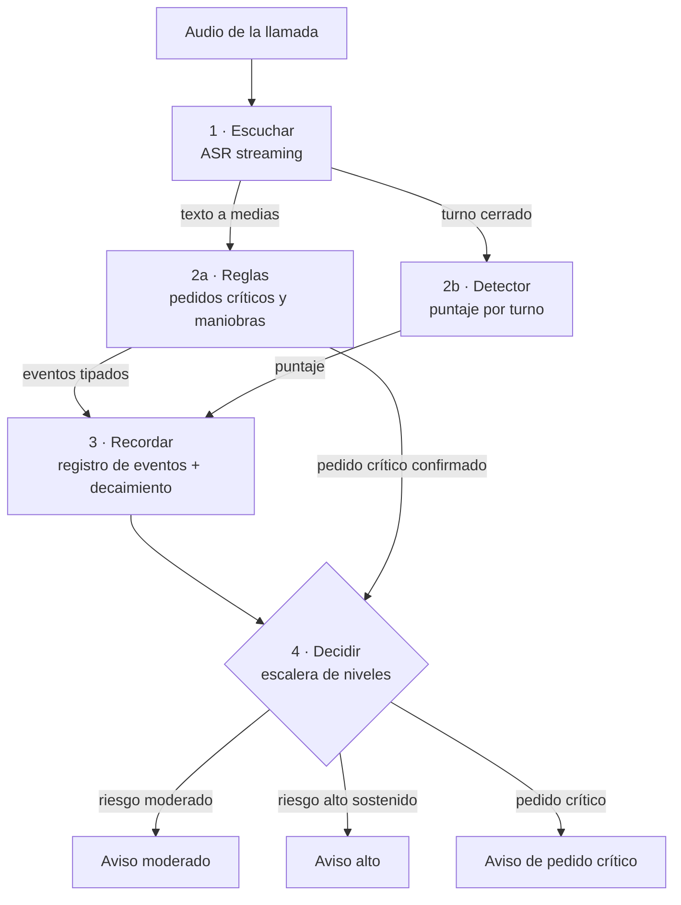

# Diseño integrado de detección incremental

**Fecha:** 2026-09-19
**Sobre:** issues [#23](https://github.com/Corchets/bitacora_tesis/issues/23) (contexto temporal y
falsas alarmas) y [#28](https://github.com/Corchets/bitacora_tesis/issues/28) /
[#29](https://github.com/Corchets/bitacora_tesis/issues/29) (spike de laboratorio).
**Estado:** recap para discutir entre los cuatro. **Propuesta sin discutir.** No cierra D08, D09
ni el modelo de estado temporal del [mapa de decisiones](../gestion/MAPA-DECISIONES.md). No es un ADR.

Este documento no reemplaza a los dos que junta. Dice cómo encajan y qué conviene hacer; el detalle
sigue viviendo en cada uno:

- [PRIMERA-INVESTIGACION-MODELOS.md](PRIMERA-INVESTIGACION-MODELOS.md) — el recorte de modelos
  (Nacho, 2026-09-15/16). Su implementación está en `experiments/laboratorio/`, en la rama
  `experimento/29-laboratorio-alta`, todavía fuera de `main`.
- [VENTANA-DE-CONTEXTO-Y-ALERTA.md](VENTANA-DE-CONTEXTO-Y-ALERTA.md) — la ventana de contexto y la
  lógica de alerta (Luciano, 2026-09-16, con las secciones 11 y 12 del 2026-09-18).
- [lecturas/2026-google-scam-detection.md](lecturas/2026-google-scam-detection.md) — la ficha de las
  defensas de Google, de donde salen los precedentes de la sección 6.

---

## 1. En criollo

Los dos diseños no compiten: resuelven partes distintas del mismo problema.

- **El recorte de modelos resolvió qué se detecta en cada momento.** Un ayudante escribe lo que se
  dice, unas reglas miran ese texto a medias buscando pedidos peligrosos, y otro ayudante le pone un
  puntaje de estafa a cada frase terminada. Son los sensores. Y ya corren en el spike.
- **La ventana de contexto resolvió qué se recuerda y cuándo se avisa.** Un registro de hechos con
  su hora y quién los dijo, que se van olvidando de a poco, y una alerta que solo salta si el riesgo
  se sostiene. Es la memoria y la decisión.

A la primera le falta memoria y una regla de persistencia que funcione (sección 4). A la segunda le
falta quién produzca los hechos: su propio resumen lo anota como el hueco más grande. Juntas se
completan.

## 2. El pipeline integrado

| Capa | Qué hace | De dónde sale | Qué hay que cambiar para juntarlos |
|---|---|---|---|
| **1. Escuchar** | ASR streaming. Escribe mientras hablan | Recorte de modelos | Nada |
| **2a. Reglas** | Miran el texto a medias. Producen eventos de pedido crítico (`REQUEST_*`) | Recorte de modelos | Buscar palabras enteras, no pedazos (sección 4). Escribirlas contra la columna "qué no la dispara" del manual de anotación, que está proponiendo el [issue #17](https://github.com/Corchets/bitacora_tesis/issues/17). Sumar reglas de **maniobras** (autoridad, urgencia, aislamiento) para que la capa 3 tenga qué recordar |
| **2b. Detector** | Un puntaje de estafa por turno cerrado. TF–IDF según #29 | Recorte de modelos | Nada: pasa a ser una entrada más de la capa 3 |
| **3. Recordar** | Registro de eventos con tiempo y rol, que pierden peso a distinto ritmo | Ventana de contexto, §5.3 y §5.5 | Reemplaza al "máximo de los últimos 3 turnos" como memoria |
| **4. Decidir** | Riesgo con doble umbral (`θ_high`, `θ_low`) sostenido dos actualizaciones, y un nivel aparte para el pedido crítico | Ventana de contexto §5.7, más el incendio del recorte | El incendio deja de ser un atajo que se saltea todo y pasa a ser el nivel más alto de la escalera |

Lo que cada capa le pasa a la siguiente es chico y tipado: texto, eventos con etiqueta, un número.
Eso permite cambiar una capa sin tocar las demás, que es lo que pide la
[arquitectura](../ingenieria/ARQUITECTURA.md) cuando separa el motor de la interfaz.

## 3. La escalera de avisos

| Nivel | Cuándo | Qué ve la persona | Histéresis |
|---|---|---|---|
| **Moderado** | El riesgo entra a la zona dudosa y se sostiene | Un aviso de que algo no cierra | Sí |
| **Alto** | El riesgo supera `θ_high` dos actualizaciones seguidas | El aviso de estafa, con la etiqueta que lo disparó como explicación | Sí. Se apaga debajo de `θ_low` |
| **Pedido crítico** | Una regla confirma un pedido de código, clave, transferencia o acceso remoto | El aviso más fuerte, en el momento del pedido | No: es el momento de mayor daño, `T_R` |

- **Un aviso por nivel por llamada**, como propone la ventana de contexto en su §5.7. Solo se escala.
- **No hay corte automático de la llamada.** Un falso positivo cortaría una llamada legítima. La
  ficha de Google recomienda descartarlo (§3.4), y Google tampoco lo implementó en el producto.
- Los avisos por pedido crítico y por riesgo sostenido se reportan **por separado**. Si no, el
  pedido crítico infla `Preventive@δ` (riesgo R14).

## 4. Lo que hay que arreglar antes de juntar

Dos problemas del recorte de modelos, los dos verificados corriendo el código del spike:

**La regla de persistencia no protege.** Con el máximo de los últimos 3 turnos, un solo pico queda
"alto" tres turnos seguidos, y "dos veces seguidas" se cumple sola. Al 99% de acierto por revisión
deja **54,8%** de llamadas legítimas con alerta, contra 55,2% sin ninguna regla. La cuenta y las
tres opciones están en la
[§11 de la ventana de contexto](VENTANA-DE-CONTEXTO-Y-ALERTA.md#11-reconciliación-con-el-contador-del-recorte-de-modelos).
El arreglo mínimo es **2 de los últimos 3**: conserva la ventana de tres turnos y baja al 1,5%.

**Las reglas saltan con frases normales.** Buscan pedazos de palabra: "se me *apagó* el celular"
dispara `REQUEST_TRANSFER` porque contiene "pago", y "me *pin*ta ir al cine" dispara
`REQUEST_SECRET`. Como el pedido crítico avisa sin histéresis, cada uno de esos es un aviso en una
llamada legítima.

## 5. Cómo se evalúa: no elegir, medir

La propuesta es no elegir entre los dos diseños a priori, sino correrlos como **dos brazos del
mismo experimento**:

| Brazo | Capas 1 y 2 | Capa 3 | Capa 4 |
|---|---|---|---|
| **Base** | Las del spike, corregidas | Ninguna: solo los últimos 3 turnos | 2 de los últimos 3 + pedido crítico |
| **Propuesta** | Las mismas | Registro de eventos con decaimiento | Escalera completa con doble umbral |

Mismo pipeline, misma llamada, misma gama: solo cambia la política de decisión, que pasa a ser una
variable más del config, como la gama en el spike. La pregunta que responde es la que la ventana de
contexto ya dejó como decisión candidata ("eje de ventana en PI1"): **¿la memoria larga mejora la
anticipación sin subir las falsas alarmas?**

Se mide con lo que ya define [METRICAS.md](../evaluacion/METRICAS.md): llamadas legítimas con
alerta, anticipación `L_R` y `L_C`, y `Preventive@δ` separando las dos fuentes de aviso. Si la
propuesta gana, es un aporte medido. Si no gana, también es un resultado, y la tesis no depende de
cuál gane.

## 6. Lo que se toma de Google

Todo sale de la solicitud de patente US 2024/0388655 A1 tal como la registra la
[ficha](lecturas/2026-google-scam-detection.md), §3.2 y §3.4. Se cita como *"una solicitud de
patente de Google describe…"*, nunca como la arquitectura del producto.

| Lo que describe la patente | Dónde entra acá |
|---|---|
| El estado entre evaluaciones es **un valor de confianza que sube y baja** [0138] | Es el precedente de la capa 3: el riesgo con decaimiento baja; el máximo de 3 turnos solo olvida |
| **Escalera de niveles**: sospecha, alerta, alerta secundaria si la persona descartó la primera, corte automático [0138]–[0157] | Ordena la capa 4. Se toman los niveles con aviso y se descarta el corte automático |
| **Dos capas de costo**: listas de palabras, frases, sentimiento y tema, más evaluaciones del modelo (reivindicaciones, pp. 19–20) | Es la capa 2. Y abre una variante medible: un detector más pesado que corra solo en la zona dudosa |
| Entre las condiciones que evalúa figura **que la persona empiece a leer el código** | Precedente del registro **conjunto**: también se registra lo que hace la víctima, no solo el que llama |
| **Sondeo activo** [0138]: en la zona dudosa, le pide a la persona que le haga una pregunta al que llama y usa la respuesta para subir o bajar la confianza | Se engancha en el indicador δ de la ventana de contexto (respuesta a la resistencia): la pregunta genera una resistencia, y la respuesta se registra como presión o como aclaración. **Extensión**, no núcleo: exige guionar pregunta y respuesta en el corpus, y probarlo con personas es una extensión del [plan de trabajo](../propuesta/PLAN-DE-TRABAJO.md) |

**El hueco que deja Google es este trabajo.** La ficha verificó que la patente no dice qué pasa en
una llamada larga: ni desborde de ventana, ni límite de tokens, ni descarte de turnos viejos (§3.2,
punto i). En su §7 lo marca como la contribución técnica más defendible: una arquitectura
incremental documentada. Las capas 3 y 4 son esa arquitectura.

## 7. Plan por fases

| Fase | Cuándo | Qué | Qué habilita |
|---|---|---|---|
| **0** | Antes de la primera corrida de #29 | 2 de los últimos 3; reglas por palabra entera; registrar el commit y contar términos críticos sin depender de las tildes | Que los números del spike signifiquen algo |
| **1** | Con el corpus v1 (20 oct–2 nov, "detector incremental" en el [cronograma](../propuesta/PLAN-DE-TRABAJO.md#11-cronograma)) | Reglas de maniobras; registro de eventos como segundo brazo; escalera de avisos | El experimento de la sección 5 |
| **2** | Solo si sobra tiempo | Sondeo activo; detector pesado en la zona dudosa | Una extensión con precedente citable |

## 8. Decisiones que tienen que tomar los cuatro

1. **Regla de persistencia para el spike**: dos seguidas sobre puntajes individuales, 2 de los
   últimos 3, o esperar a la escalera completa.
2. **Adoptar los dos brazos** como diseño del experimento, en lugar de elegir un diseño antes de
   medir.
3. **La escalera de tres niveles** y el descarte del corte automático.
4. **Reglas de maniobras en la capa 2**: dependen de que se cierre la taxonomía (D07).
5. **Sondeo activo**: si entra como extensión o queda como trabajo futuro.

La lista completa de decisiones que surgen de la ventana de contexto está en su
[§9](VENTANA-DE-CONTEXTO-Y-ALERTA.md#9-decisiones-que-surgen).

## 9. Lo que este documento no dice

- **No mide nada.** Los números de falsas alarmas salen de una simulación que supone errores
  independientes. Los de la ventana de contexto salen de llamadas construidas a mano.
- **No elige motor ni lenguaje.** Eso sigue en D09.
- **No convierte a la patente en arquitectura del producto de Google.** Es lo que la solicitud
  describe, no lo que el producto demuestra hacer.
