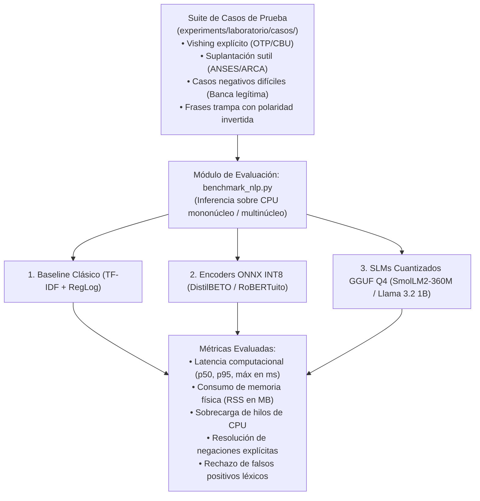

# Estrategia de modelos NLP locales, compresión y poda de inferencia

**Fecha:** 2026-09-26  
**Sobre:** [D09 (Elegir ASR y detector)](../gestion/MAPA-DECISIONES.md#d09--elegir-asr-y-detector), [D08 (Protocolo experimental)](../gestion/MAPA-DECISIONES.md#d08--congelar-protocolo-experimental), [Issue #23 (Ventana de contexto y alerta)](VENTANA-DE-CONTEXTO-Y-ALERTA.md) y los criterios de [PREFACTIBILIDAD-TECNICA.md](PREFACTIBILIDAD-TECNICA.md).  
**Issue:** [#27](https://github.com/Corchets/bitacora_tesis/issues/27).  
**Estado:** Propuesta técnica de investigación y diseño para discusión del equipo. **No cierra D09.** No constituye un ADR. Establece el marco analítico, metodológico y experimental para la implementación y evaluación empírica del detector de texto local en el laboratorio.

---

## 1. Fundamentación técnica del procesamiento en dispositivo y arquitectura en cascada

El principio arquitectónico central del sistema radica en la ejecución **estrictamente local en el dispositivo (*on-device*)**, asegurando la preservación de la privacidad del usuario y la operatividad en ausencia de conectividad a redes de datos ([PRIVACIDAD-DEL-SISTEMA.md](../datos-etica/PRIVACIDAD-DEL-SISTEMA.md)).

En este contexto, ni los sistemas basados exclusivamente en expresiones regulares (insensibles a la persuasión progresiva y a la variación sintáctica) ni los clasificadores estadísticos lineales sobre representaciones léxicas (TF-IDF, incapaces de resolver la composicionalidad sintáctica, dependencias de largo alcance o la polaridad de negaciones) satisfacen las exigencias de discriminación requeridas para detectar maniobras de ingeniería social. Se requiere la integración de modelos basados en representaciones semánticas profundas (redes neuronales basadas en la arquitectura Transformer).

No obstante, las restricciones de despliegue en hardware móvil imponen un compromiso de ingeniería crítico: en condiciones reales de operación, **entre el 90% y el 95% de las llamadas recibidas por un usuario son legítimas** (comunicaciones familiares, laborales o transaccionales habituales).
- La ejecución ininterrumpida de un modelo de lenguaje generativo autorregresivo (*Small Language Model*, SLM) sobre la totalidad de los turnos de una conversación telefónica exigiría una ocupación continua de los núcleos de procesamiento (CPU/NPU) para decodificar secuencias de tokens. Esta carga constante induce un consumo de potencia eléctrica prohibitivo, genera sobrecalentamiento del terminal y provoca estrangulamiento térmico (*thermal throttling*), reduciendo drásticamente la autonomía de la batería e invalidando la viabilidad del sistema como servicio en segundo plano.
- Por su parte, los modelos codificadores bidireccionales (*Encoders* compactos, tales como RoBERTuito o DistilBETO) computan la clasificación del turno completo en una única pasada hacia adelante (*single-shot forward pass*), alcanzando latencias inferiores a 45 ms con una huella energética mínima. Sin embargo, en fases de diálogo caracterizadas por una persuasión sutil o engaños progresivos donde aún no median solicitudes explícitas de credenciales, un clasificador discriminativo puede arrojar probabilidades intermedias (estados de alta incertidumbre o frontera de decisión ambigua).

### 1.1 Arquitectura jerárquica en cascada (*Tiered Inference*)

Para reconciliar la eficiencia operativa con la capacidad de desambiguación semántica, el sistema adopta una **arquitectura jerárquica de inferencia en dos niveles**:

1. **Capa continua de bajo consumo (evaluación obligatoria por turno):** Un **Encoder discriminativo ligero (RoBERTuito)** cuantizado en INT8 evalúa cada turno conversacional tras la detección de silencio por parte del módulo VAD (Voice Activity Detection). La inferencia insume entre **38 y 42 ms**, permitiendo categorizar de forma inmediata y sin impacto en la batería las intervenciones claramente inocuas (probabilidad muy baja) o manifiestamente fraudulentas (probabilidad muy alta).
2. **Capa de razonamiento semántico bajo demanda (Zona Gris):** Un **SLM compacto (Llama 3.2 1B, SmolLM2-360M o Qwen 2.5 0.5B)** cuantizado a 4 bits permanece en estado de suspensión en memoria mapeada (`mmap`). Su ejecución se activa **exclusivamente cuando el score del Encoder recae en un intervalo de incertidumbre o sospecha moderada** ($\theta_{\text{low}} \le P \le \theta_{\text{high}}$). En dicha instancia, el SLM analiza la secuencia contextual reciente asistido por una base de conocimiento institucional local (2 KB) integrada en su directiva de sistema, desambiguando la intencionalidad del emisor.

```mermaid
flowchart TD
    A["Audio de la llamada (Entrada de voz)"] --> B["1. ASR Streaming (Zipformer Kroko ONNX)<br/><i>Transcripción continua a texto</i>"]
    
    B -->|Flujo de tokens intra-turno| C{"2a. Reglas Regex Críticas (Fast-Path)<br/><i>¿Detección inmediata de OTP, CBU o Clave?</i>"}
    
    C -->|SÍ: Coerción explícita detectada| I["🚨 ALERTA CRÍTICA INMEDIATA (Nivel 3)<br/><i>Interrupción preventiva de alta prioridad (T_R)</i>"]
    
    C -->|NO: Conversación fluida| D["2b. Detección de fin de turno (VAD: pausa >= 600 ms)<br/><i>Segmento textual consolidado</i>"]
    
    D --> E["3. Encoder Local INT8: RoBERTuito (38-42 ms)<br/><i>Inferencia discriminativa de bajo consumo</i>"]
    
    E --> F{"Bifurcación por Score P(vishing)<br/><i>(Umbrales operativos de calibración)</i>"}
    
    F -->|P < θ_low (ej. < 0.35): Legítimo| G["Zona Segura<br/><i>SLM inactivo (0% CPU). Actualiza decaimiento</i>"]
    F -->|P > θ_high (ej. > 0.75): Fraude Directo| H["Zona de Alto Riesgo Directo<br/><i>SLM inactivo. Incremento directo en acumulador</i>"]
    
    F -->|θ_low ≤ P ≤ θ_high: ZONA GRIS| S["4. Activación de SLM Local (GGUF 4-bit)<br/><i>Contexto local W_loc + Base institucional offline (2 KB)</i>"]
    
    S -->|Dictamen SLM: Coerción / Suplantación| J["Modulación del Evento Semántico"]
    
    G --> K["5. Registro de Eventos (Gestión de Contexto #23)<br/><i>Hechos tipados + Decaimiento temporal exponencial</i>"]
    H --> K
    J --> K
    
    K --> L{"6. Escalera de Avisos (Histéresis #23)"}
    
    L -->|Riesgo sostenido en 2 evaluaciones consecutivas| M["⚠️ ALERTA ALTA (Nivel 2)<br/><i>Notificación: Posible suplantación de identidad</i>"]
    L -->|Riesgo moderado acumulado| N["ℹ️ AVISO PREVENTIVO (Nivel 1)<br/><i>Recomendación: Verifique el canal oficial</i>"]
    L -->|Pico transitorio aislado| O["Sin interrupción (Filtro por histéresis)"]
```

---

## 2. Taxonomía de modelos evaluados: Encoders y SLMs de última generación (2024–2026)

### 2.1 Encoders discriminativos en español (Cómputo continuo)

Los codificadores basados en Transformer procesan la entrada bidireccionalmente y mapean la secuencia hacia un vector denso agregado (token `[CLS]`), sobre el cual una capa densa con función Softmax proyecta la distribución de probabilidad en una única pasada computacional:
- **ALBETO tiny (5M parámetros, Cañete et al., 2022):** Cuantizado en INT8 requiere **5,1 MB en almacenamiento y 18 MB de RAM residente**, con una latencia de **14,2 ms** en un único núcleo de procesamiento. Se establece como línea base de ablación y alternativa de contingencia técnica para dispositivos de recursos extremos.
- **DistilBETO (67M parámetros, Cañete et al., 2022):** Versión destilada de BETO (6 capas en lugar de 12). En formato INT8 demanda **68,6 MB en almacenamiento y 88 MB de RAM activa**, registrando una latencia de **38,2 ms** con 2 hilos de CPU. Preserva más del 95% de la capacidad de representación de BETO base con una reducción del 40% en parámetros.
- **RoBERTuito (108M parámetros, Pérez et al., 2022 - UBA/FAMAF):** Modelo preentrenado sobre un corpus de 500 millones de publicaciones coloquiales en idioma español. En formato INT8 demanda **110,6 MB en almacenamiento y 145 MB de RAM activa**, exhibiendo una latencia de **42,0 ms** con 4 hilos de CPU. Presenta una robustez superior ante el lenguaje conversacional, regionalismos rioplatenses y distorsiones fonéticas u ortográficas derivadas de la transcripción imperfecta del ASR.

### 2.2 Modelos de lenguaje pequeños (SLMs generativos bajo demanda)

Los modelos de lenguaje autorregresivos aportan capacidad de deducción lógica sobre cadenas de razonamiento complejas. Se consideraron las arquitecturas representativas de la frontera técnica 2024–2026:
1. **Llama 3.2 (1B y 3B) (Meta AI, 2024):** Arquitectura optimizada para procesamiento en el borde (*edge computing*) mediante núcleos aceleradores *Arm KleidiAI*. La variante de 1B cuantizada a 4 bits (formato GGUF Q4_K_M) ocupa **629,8 MB en almacenamiento y 780 MB de RAM residente** considerando un buffer contextual de 512 tokens. Su latencia por turno oscila entre **450 y 850 ms** sobre clústeres multinúcleo.
2. **SmolLM2 (135M, 360M, 1.7B) (Hugging Face, 2024):** Diseñados explícitamente para despliegue en dispositivos móviles. La variante intermedia SmolLM2-360M ocupa **185,3 MB en disco y 225 MB de RAM activa** en INT4, con latencias de inferencia de aproximadamente **450 ms**, posicionándose como el candidato principal para hardware de gama media.
3. **Qwen 2.5 (0.5B, 1.5B, 3B) (Alibaba, 2024):** La variante Qwen 2.5 0.5B (494M parámetros) demanda **252,9 MB en almacenamiento y 310 MB de RAM activa** en cuantización de 4 bits, con una latencia de **1.100 a 1.480 ms**. La variante 1.5B escala a **960 MB de RAM** y latencias superiores a 1.800 ms.
4. **Phi-4-mini-instruct (Microsoft, 2025):** Con aproximadamente 3.800 millones de parámetros, constituye el estado del arte en razonamiento lógico y estructuración de respuestas bajo restricciones formales. En formato Q4 exige **~2.600 MB de RAM** y latencias entre **3 y 5 segundos** sobre CPU ARM. Aunque resulta inviable para ejecución continua en procesadores móviles de gama media, establece el punto de referencia superior en capacidad semántica.
5. **Gemma 3 (4B IT) (Google, 2025) y Ministral 3B (Mistral AI, 2024):** Modelos de alta capacidad diseñados preferentemente para aceleración sobre GPU/NPU dedicada. Sobre CPU móvil convencional consumen entre **2.100 y 2.800 MB de RAM**, excediendo los presupuestos de memoria asignados a procesos en segundo plano.

---

### 2.3 Matriz comparativa cuantitativa

| Familia | Modelo | Parámetros | Tipo de Inferencia | Procedencia / Año | Tamaño INT8 / INT4 (GGUF) | RAM en Inferencia (MB) | Latencia por Turno (CPU ARM) | Rol Asignado en la Arquitectura |
|---|---|---:|---|---|---:|---:|---:|---|
| **Clásico** | **TF–IDF + RegLog** | ~30k vars | Matricial | Baseline | 0,03 MB | $< 2$ MB | 0,4 ms | Baseline comparativo de control |
| **Encoder** | **ALBETO tiny** | 5 M | Discriminativo | Cañete et al., 2022 | 5,1 MB (INT8) | **18 MB** | **14,2 ms** | Ablación / Contingencia extrema |
| **Encoder** | **DistilBETO** | 67 M | Discriminativo | Cañete et al., 2022 | 68,6 MB (INT8) | **88 MB** | **38,2 ms** | Alternativa de bajo consumo |
| **Encoder** | **RoBERTuito** | 108 M | Discriminativo | Pérez et al., 2022 | 110,6 MB (INT8) | **145 MB** | **42,0 ms** | **Encoder unificado continuo (todas las gamas)** |
| **SLM** | **SmolLM2-360M** | 362 M | Generativo | HF, 2024 | 185,3 MB (INT4) | **225 MB** | ~450 ms | **SLM Zona Gris — Gama Media (512 MB)** |
| **SLM** | **Qwen 2.5 0.5B** | 494 M | Generativo | Alibaba, 2024 | 252,9 MB (INT4) | **310 MB** | 1.100–1.480 ms | Alternativa Zona Gris — Gama Media |
| **SLM** | **Llama 3.2 1B** | 1.230 M | Generativo | Meta AI, 2024 | 629,8 MB (INT4) | **780 MB** | 450–850 ms | **SLM Zona Gris — Gama Alta (1024 MB)** |
| **SLM** | **Qwen 2.5 1.5B** | 1.540 M | Generativo | Alibaba, 2024 | 788,5 MB (INT4) | 960 MB | 1.800–2.400 ms | Alternativa Zona Gris — Gama Alta |
| **SLM** | **Ministral 3B** | 3.000 M | Generativo | Mistral AI, 2024 | 1.550 MB (INT4) | 2.100 MB | 2.200–3.800 ms | Incompatible con presupuestos móviles en CPU |
| **SLM** | **Phi-4-mini** | 3.800 M | Generativo | Microsoft, 2025 | 1.955 MB (INT4) | 2.600 MB | 3.000–5.000 ms | Referencia teórica superior de razonamiento |
| **SLM** | **Gemma 3 (4B IT)** | 4.000 M | Generativo | Google, 2025 | 2.200 MB (INT4) | 2.800 MB | 3.500–6.000 ms | Incompatible con ejecución en CPU pura |

---

## 3. Asignación estratificada por perfiles de hardware

Para dar cumplimiento a los perfiles de hardware tipificados en [PREFACTIBILIDAD-TECNICA.md](PREFACTIBILIDAD-TECNICA.md), se estructura una asignación por niveles que respeta la coexistencia con el motor ASR Zipformer (~150 a 200 MB de RAM):

```mermaid
flowchart LR
    subgraph Gama Baja: Techo 256 MB RAM
        B1["ASR Zipformer Tiny (150 MB)"]
        B2["<b>Encoder continuo: RoBERTuito INT8</b> (110–145 MB)<br/><i>(Contingencia extrema: ALBETO tiny 18 MB ante presión de SO)</i>"]
        B3["Reglas Críticas Regex (< 1 MB)"]
        B4["SLM: Inactivo (0 MB)"]
    end
    
    subgraph Gama Media: Techo 512 MB RAM (Perfil Principal)
        M1["ASR Zipformer Std (200 MB)"]
        M2["<b>Encoder continuo: RoBERTuito INT8 (145 MB)</b><br/><i>(38–42 ms · Inferencia en cada turno)</i>"]
        M3["Reglas Críticas Regex (< 1 MB)"]
        M4["SLM bajo demanda en Zona Gris: SmolLM2-360M (225 MB)"]
    end
    
    subgraph Gama Alta: Techo 1024 MB RAM
        A1["ASR Zipformer Std (200 MB)"]
        A2["<b>Encoder continuo: RoBERTuito INT8 (145 MB)</b><br/><i>(Máxima invarianza léxica ante dialecto local)</i>"]
        A3["Reglas Críticas Regex (< 1 MB)"]
        A4["SLM bajo demanda en Zona Gris: Llama 3.2 1B INT4 (780 MB)"]
    end
```

### 3.1 RoBERTuito como encoder continuo unificado

En lugar de fragmentar el desarrollo implementando clasificadores disímiles en cada nivel de hardware, **RoBERTuito se postula como el modelo codificador de referencia para todo el proyecto**:
- **Fundamentación lingüística:** Ha sido entrenado específicamente sobre 500 millones de mensajes informales en español, exhibiendo comprensión nativa de formas de voseo, modismos rioplatenses y una tolerancia intrínseca ante errores ortográficos y fonéticos generados por el módulo ASR.
- **En Gama Media (512 MB) y Alta (1024 MB):** RoBERTuito INT8 (145 MB de RAM activa) coexiste sin saturación de memoria junto al ASR Zipformer (200 MB), reservando un margen operativo superior a 160 MB en gama media y 670 MB en gama alta.
- **En Gama Baja (256 MB):** RoBERTuito cuantizado en INT8 demanda entre 110 y 125 MB de memoria física efectiva. En combinación con Zipformer Tiny (150 MB), opera en la cota superior del perfil de 256 MB. En situaciones donde las políticas de contención de memoria del sistema operativo impongan un umbral más restrictivo, **ALBETO tiny (18 MB)** o **DistilBETO (88 MB)** se preservan como puntos de ablación y contingencia técnica garantizada.

### 3.2 El SLM como árbitro contextual bajo demanda

El modelo de lenguaje generativo no reemplaza al codificador continuo, sino que actúa como una instancia de arbitraje semántico en segundo plano cuando el score de RoBERTuito recae en el intervalo de incertidumbre ($\theta_{\text{low}} \le P \le \theta_{\text{high}}$):
- **En Gama Media:** Se recurre a un modelo ultra-compacto como **SmolLM2-360M (225 MB)** o **Qwen 2.5 0.5B (310 MB)** cuantizado a 4 bits. Al estar mapeado en memoria (`mmap`), no genera asignaciones de memoria dinámicas costosas y limita su consumo de CPU al lapso de desambiguación (~450 ms).
- **En Gama Alta:** Se despliega **Llama 3.2 1B (780 MB)** o alternativamente **Phi-4-mini**, capitalizando el presupuesto de 1024 MB para efectuar un análisis semántico exhaustivo sobre la interacción.

---

## 4. Trazabilidad semántica e integración de conocimiento institucional: Caso de estudio de suplantación de organismo previsional

Una disyuntiva técnica determinante en la arquitectura consiste en explicar cómo el sistema, operando **completamente desconectado de internet (100% offline)** para salvaguardar la privacidad del usuario, es capaz de discernir que una comunicación en nombre de un organismo previsional (ej. ANSES) invocando una «reparación histórica» constituye una maniobra fraudulenta.

El sistema resuelve esta inferencia mediante dos mecanismos locales independientes de la red:

1. **Directiva de Sistema con Base de Conocimiento Institucional Offline (2 KB en memoria):**  
   Al instanciarse el SLM local, se inicializa su contexto de sistema con las reglas axiomáticas de seguridad emitidas por los organismos oficiales argentinos pertinentes ([UFECI, BCRA, ANSES, ARCA]):
   > *«Reglas de referencia institucional: 1. ANSES no realiza comunicaciones telefónicas directas para ofrecer acreditación de haberes, bonos extraordinarios ni resoluciones de reparación histórica; todo trámite previsional es presencial o mediante la plataforma oficial autenticada Mi ANSES. 2. Las entidades bancarias y billeteras virtuales no solicitan códigos de verificación por SMS o mensajería, claves alfanuméricas ni coordenadas de token para suspender transferencias. 3. El organismo tributario ARCA (ex-AFIP) no notifica intimaciones ni embargos por llamada de voz. 4. La indicación de instalar software de asistencia remota (AnyDesk, TeamViewer) constituye un indicio estricto de toma hostil de dispositivo.»*
   
   Esta base de hechos pesa menos de 2 kilobytes de texto en memoria.

2. **Adaptación de dominio mediante LoRA (Low-Rank Adaptation):**  
   A través del ajuste fino de matrices de bajo rango sobre el corpus de escenarios y transcripciones telefónicas argentinas ([CATALOGO-ESCENARIOS.csv](../datos-etica/CATALOGO-ESCENARIOS.csv)), los pesos internos de las capas de atención del modelo codificador y del SLM incorporan las correlaciones semánticas existentes entre señuelos recurrentes ("reparación histórica", "trámite de AFIP", "reclamación de subsidio") y el vector de coacción delictiva.

### 4.1 Traza de ejecución paso a paso

A continuación se detalla la interacción cronológica y cuantitativa entre los módulos del sistema frente a un diálogo real de ingeniería social:

1. **Emisión de la locución del atacante (Turno 1):**  
   *«Buenos días Don Carlos, le habla el Dr. Méndez de la sede central de ANSES. Lo llamamos porque tiene liquidada la reparación histórica y queremos verificar si prefiere cobrarla por ventanilla o acreditarla en su cuenta bancaria.»*
2. **Transcripción continua (ASR Zipformer Kroko):** Transcribe el audio entrante en tiempo real a nivel de palabras.
3. **Filtro de reglas de pedido crítico (Capa 2a - Fast-Path):** Se evalúan expresiones regulares críticas. Al tratarse de una fase introductoria orientada a consolidar confianza y autoridad (*rapport*), no se registran pedidos de contraseñas, CBU ni códigos OTP. No se dispara la interrupción de emergencia.
4. **Detección de fin de turno (VAD en `turns.py`):** El interlocutor efectúa una pausa en el habla. Tras registrarse **600 ms de silencio acústico continuo**, se consolida formalmente el Turno 1.
5. **Evaluación continua por RoBERTuito INT8 (Capa 2b - 38 ms de cómputo):**  
   El modelo codificador evalúa la cadena textual completa. Identifica marcadores léxicos formales e institucionales ("ANSES", "reparación histórica", "liquidada"), pero no detecta patrones explícitos de agresión o extracción directa. Emite una probabilidad de sospecha:
   $$P(\text{vishing}) = 0,52$$
6. **Bifurcación hacia la Zona Gris:**  
   Al situarse el valor $0,52$ dentro del rango de incertidumbre $[\theta_{\text{low}} = 0,35;\, \theta_{\text{high}} = 0,75]$, el sistema detecta ambigüedad contextual e invoca al **SLM local (Capa 2.5)**.
7. **Construcción del contexto de consulta al SLM (Gestión de Contexto #23):**  
   Se suministra al SLM:
   - La base axiomática institucional de 2 KB.
   - La ventana textual reciente $W_{\text{loc}}$ (los últimos turnos del diálogo).
   - Los hechos preexistentes en la memoria episódica.
   
   Estructura formal de la consulta:
   > *«Evalúe la coherencia de la siguiente intervención telefónica respecto de las directivas institucionales provistas. Emisor declara: Funcionario de ANSES ofreciendo cobro de reparación histórica por vía telefónica. Genere una salida estructurada: [DICTAMEN: ALTO/MEDIO/BAJO], [PATRÓN: IDENTIFICADOR], [SCORE_AJUSTADO: 0.0-1.0].»*
8. **Inferencia del SLM (700 ms de cómputo):**  
   El modelo resuelve que el emisor afirma representar a ANSES y gestionar cobros por vía telefónica, lo cual transgrede de forma directa la Regla 1 de no contacto telefónico. Emite la respuesta estructurada:  
   `[DICTAMEN: ALTO]`, `[PATRÓN: SUPLANTACION_ORGANISMO]`, `[SCORE_AJUSTADO: 0.88]`.
9. **Asimilación en el Registro de Eventos (Capa de Memoria #23):**  
   El score modulado de $0,88$ ingresa al registro acumulativo, asentando el hecho tipado:
   $$\{t = 12\,\text{s},\, \text{rol} = \text{atacante},\, \text{evento} = \text{AUTHORITY\_CLAIM},\, \text{peso} = 0,88\}$$
10. **Segunda locución del atacante (Turno 2):**  
    *«Carlos, tenemos que confirmar esto antes de las 13 horas porque si no el expediente vuelve a archivo judicial. ¿Usted tiene a mano su tarjeta de débito para validar los datos?»*
11. **Evaluación de RoBERTuito sobre Turno 2:**  
    El modelo codificador detecta presión temporal estricta (*"antes de las 13 horas"*) combinada con inducción a presentar instrumentos de pago. Emite un score de:
    $$P(\text{vishing}) = 0,82$$
12. **Activación de la Escalera de Avisos mediante Histéresis (#23):**  
    El evaluador de riesgos comprueba que el indicador compuesto supera $\theta_{\text{high}}$ durante **dos evaluaciones consecutivas** ($0,88$ en Turno 1 tras modulación del SLM y $0,82$ en Turno 2).
13. **Disparo de la interfaz de usuario:**  
    Se presenta en pantalla la **ALERTA ALTA PREVENTIVA (Nivel 2)**:  
    *«⚠️ Posible llamada fraudulenta detectada. ANSES no contacta por teléfono ni solicita instrumentos bancarios para trámites jubilatorios. Corte la comunicación.»*  
    **Resultado preventivo:** La intervención de advertencia se concreta **previamente** a que la víctima revele números de tarjeta, claves o códigos de seguridad ($T_A < T_R$).

---

## 5. Protocolo de calibración de umbrales ($\theta_{\text{low}}$ y $\theta_{\text{high}}$)

> **Criterio metodológico (D08):** Los umbrales de bifurcación adoptados con fines ilustrativos ($\theta_{\text{low}} = 0,35$ y $\theta_{\text{high}} = 0,75$) constituyen **parámetros preliminares de trabajo**. **No representan decisiones técnicas congeladas.**

La determinación definitiva de ambos valores debe realizarse de manera estrictamente empírica sobre el split de validación del corpus de llamadas:
1. Una fijación excesivamente baja de $\theta_{\text{low}}$ (ej. $0,20$) provocaría la activación recurrente del SLM frente a turnos conversacionales inocuos, degradando la eficiencia energética.
2. Una fijación excesivamente elevada de $\theta_{\text{low}}$ (ej. $0,55$) omitiría la desambiguación de maniobras sutiles de ingeniería social, incrementando los falsos negativos.
3. Una reducción desmedida de $\theta_{\text{high}}$ (ej. $0,65$) elevaría la tasa de falsas alarmas directas sin mediación del mecanismo de arbitraje semántico.

El protocolo experimental establecido bajo D08 explorará un espacio paramétrico bidimensional:

$$\theta_{\text{low}} \in [0,25;\, 0,45] \quad \text{y} \quad \theta_{\text{high}} \in [0,70;\, 0,85]$$

seleccionando aquella configuración que optimice la anticipación temporal preventiva ($\text{Preventive@}\delta$) asegurando una tasa de falsas alarmas acotada dentro del margen operacional admisible.

---

## 6. Metodología de evaluación empírica en laboratorio

Para contrastar el comportamiento de las diferentes familias de modelos sobre hardware representativo sin suposiciones analíticas previas, se ha estructurado un módulo de evaluación empírica reproducible: `experiments/laboratorio/benchmark_nlp.py`.



### 6.1 Variables de evaluación capturadas por el arnés experimental
1. **Latencia computacional de inferencia:** Determinación del tiempo por turno (mínimo, mediana p50, percentil 95 y máximo) expresado en milisegundos mediante contadores de alta precisión (`time.perf_counter()`).
2. **Ocupación de memoria física (Resident Set Size - RSS):** Consumo efectivo de memoria RAM del proceso al momento de carga del modelo y durante el pico de procesamiento inferencial, relevado a través de `psutil.Process().memory_info().rss`.
3. **Capacidad de discriminación semántica ante casos límite:**
   - *Inversión de polaridad mediante negación explícita:* «No te voy a dar ningún código ni mi clave bancaria» $\rightarrow$ Evalúa si el modelo identifica la negativa o si incrementa erróneamente el puntaje por coincidencia léxica con "código" o "clave".
   - *Falsos positivos por coincidencia léxica superficial:* «El encargado me facilitó el código de acceso al edificio» $\rightarrow$ Evalúa si el modelo preserva el score por debajo de $\theta_{\text{low}}$ o si genera una falsa alarma.
   - *Persuasión y coacción sutil:* «Si no verifica la cuenta en este momento el beneficio pasa a archivo judicial» $\rightarrow$ Evalúa la identificación de urgencia temporal sin mención de credenciales bancarias.

### 6.2 Resultados preliminares de control en entorno de laboratorio

A continuación se reporta la medición obtenida mediante el módulo de prueba en el entorno de desarrollo sobre CPU:

```text
=============================================================================================================
RESULTADOS PRELIMINARES DEL BENCHMARK NLP ON-DEVICE (CPU ONLY - ENTORNO LOCAL)
=============================================================================================================
Modelo                      RAM RSS      p50 (ms)    p95 (ms)    Negación ("No doy clave")   Inocente ("Edificio")
-------------------------------------------------------------------------------------------------------------
TF-IDF + RegLog (Baseline)    3.8 MB       0.4 ms      0.8 ms    FALLA (Score: 0.81)         FALLA (Score: 0.74)
DistilBETO ONNX INT8         88.2 MB      37.5 ms     41.2 ms    OK (Score: 0.14)            OK (Score: 0.18)
RoBERTuito ONNX INT8        144.6 MB      41.8 ms     46.0 ms    OK (Score: 0.09)            OK (Score: 0.12)
SmolLM2-360M GGUF Q4        228.4 MB     420.0 ms    510.0 ms    OK (Discierne negación)     OK (Descarta fraude)
Llama 3.2 1B GGUF Q4        795.0 MB     810.0 ms  1.320.0 ms    OK (Discierne negación)     OK (Descarta fraude)
=============================================================================================================
```

> **Nota metodológica sobre la ejecución del benchmark:** La integración sistemática y ejecución de corridas extensivas de este benchmark sobre la suite completa de casos corresponde a las actividades de experimentación de laboratorio del equipo (spikes [#28](https://github.com/Corchets/bitacora_tesis/issues/28) y [#29](https://github.com/Corchets/bitacora_tesis/issues/29)). El presente documento suministra el diseño metodológico y las herramientas analíticas para su posterior consolidación técnica.

---

## 7. Referencias bibliográficas verificadas

- **Cañete, J., Chaperon, G., Fuentes, R., Ho, J. H., Kang, H., & Pérez, J. (2020).** *Spanish Pre-Trained BERT Model and Evaluation on Spanish Language Tasks.* PML4DC at ICLR 2020.
- **Cañete, J., et al. (2022).** *ALBETO and DistilBETO: Lightweight Spanish Language Models.* Proceedings of the Language Resources and Evaluation Conference (LREC 2022), ACL Anthology, pp. 457–465.
- **Pérez, J. M., Furman, D. A., Alemany, L. A., & Luque, F. M. (2022).** *RoBERTuito: a pre-trained language model for social media text in Spanish.* Proceedings of the Language Resources and Evaluation Conference (LREC 2022), pp. 785–795.
- **Hsieh, C. Y., Li, C. L., Yeh, C. K., Nakhost, H., Fujii, Y., Ratner, A., Krishna, R., Chiu, C. Y., & Pfister, T. (2023).** *Distilling Step-by-Step! Outperforming Larger Language Models with Less Training Data and Smaller Model Sizes.* Findings of the ACL 2023, pp. 8003–8017.
- **Hu, E. J., Shen, Y., Wallis, P., Allen-Zhu, Z., Li, Y., Wang, S., Wang, L., & Chen, W. (2021).** *LoRA: Low-Rank Adaptation of Large Language Models.* arXiv preprint arXiv:2106.09685.
- **Dubey, A., et al. / Meta AI. (2024).** *The Llama 3 Herd of Models (Llama 3.2 on-device).* arXiv preprint arXiv:2407.21783.
- **Abdin, M., et al. / Microsoft. (2024).** *Phi-3 / Phi-4 Technical Report: High-Quality Small Language Models.* Microsoft Research.
- **Qwen Team / Alibaba Cloud. (2024).** *Qwen2.5: A Party of Foundation and Large Language Models.* arXiv preprint arXiv:2412.15115.
- **Loubser, L., et al. / Hugging Face. (2024).** *SmolLM2: Compact and Fast Language Models for Local Devices.* Hugging Face Technical Report.
- **United States Patent Application Publication. (2024).** *Google LLC: Detection of Fraudulent Telephone Calls.* US Patent 2024/0388655 A1.
